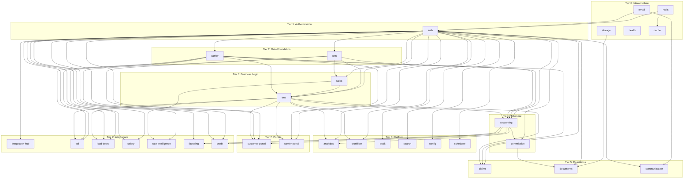
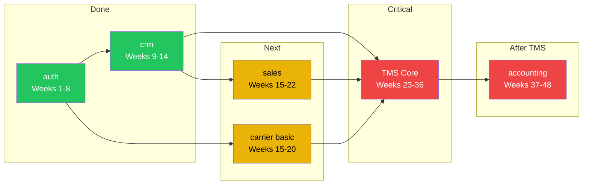
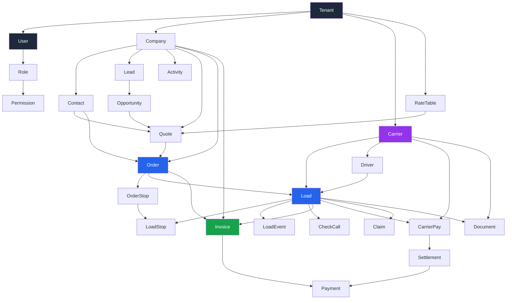

# Module Dependency Graph

**Project:** Ultra TMS - 3PL Logistics Platform
**Review Date:** 2026-02-07
**Reviewer:** Claude Opus 4.6
**Scope:** Module dependency ordering, build sequence, and critical path analysis

---

## Table of Contents

1. [Executive Summary](#1-executive-summary)
2. [Database Entity Dependency Chain](#2-database-entity-dependency-chain)
3. [Backend Module Dependencies](#3-backend-module-dependencies)
4. [Frontend-to-Backend Dependency Map](#4-frontend-to-backend-dependency-map)
5. [Correct Build Order](#5-correct-build-order)
6. [Mermaid Dependency Diagrams](#6-mermaid-dependency-diagrams)
7. [Circular Dependency Risks](#7-circular-dependency-risks)
8. [Critical Path Analysis](#8-critical-path-analysis)
9. [Parallel Track Identification](#9-parallel-track-identification)

---

## 1. Executive Summary

The Ultra TMS platform has **38 active backend modules** (`apps/api/src/modules/`) backed by **257 Prisma models** (`apps/api/prisma/schema.prisma`). These modules form a directed dependency graph where some modules are foundational (referenced by many others) and some are leaf nodes (depend on others but nothing depends on them).

**Key Findings:**

- **Auth is the root dependency.** Every module depends on auth for JWT guards, user context, and tenant isolation.
- **CRM is the second-most critical dependency.** Orders, quotes, invoices, and carrier assignments all reference Company and Contact entities.
- **TMS Core is the central hub.** Order and Load entities are referenced by 12+ downstream modules (accounting, carrier, tracking, dispatch, documents, etc.).
- **No true circular dependencies exist** at the module level, but there are bidirectional data relationships (e.g., Company can be both a customer and a carrier) that require careful modeling.
- **The critical path** runs: Auth -> CRM -> Sales -> TMS Core -> Accounting. Any delay on this chain delays the entire project.

---

## 2. Database Entity Dependency Chain

### 2.1 Core Entity Relationships

Based on the Prisma schema (257 models, 114 enums), the major entity dependencies are:

#### Tier 0: Foundation (No Dependencies)

These models depend only on themselves and system infrastructure:

| Model | Purpose | Referenced By |
|-------|---------|--------------|
| `Tenant` | Multi-tenancy root | Every other model |
| `User` | Authentication/authorization | Every model with `createdBy`/`updatedBy` |
| `Role` | RBAC | `UserRole`, guards |
| `Permission` | Granular access | `RolePermission` |

#### Tier 1: CRM Entities (Depends on Tier 0)

| Model | Dependencies | Referenced By |
|-------|-------------|--------------|
| `Company` | `Tenant` | `Contact`, `Quote`, `Order`, `Invoice`, `Carrier`, `Lead`, `Opportunity` |
| `Contact` | `Company`, `Tenant` | `Quote`, `Order`, `Activity` |
| `Lead` | `Tenant` | `Opportunity`, `Activity` |
| `Opportunity` | `Company`, `Contact`, `Tenant` | `Quote`, `Activity` |
| `Activity` | `Company`, `Contact`, `User`, `Tenant` | (leaf node) |

#### Tier 2: Sales Entities (Depends on Tier 1)

| Model | Dependencies | Referenced By |
|-------|-------------|--------------|
| `Quote` | `Company`, `Contact`, `Opportunity`, `User`, `Tenant` | `QuoteLine`, `Order` (conversion) |
| `QuoteLine` | `Quote` | (leaf node within sales) |
| `RateTable` | `Tenant` | `RateTableEntry`, `Quote` |
| `RateTableEntry` | `RateTable` | `Quote` (rate lookup) |
| `Accessorial` | `Tenant` | `QuoteLine`, `InvoiceLine` |

#### Tier 3: TMS Core Entities (Depends on Tier 1 + 2)

| Model | Dependencies | Referenced By |
|-------|-------------|--------------|
| `Order` | `Company` (customer), `Contact`, `Quote`, `User`, `Tenant` | `Load`, `OrderStop`, `Invoice` |
| `OrderStop` | `Order`, `Company` (facility) | `LoadStop` |
| `Load` | `Order`, `Carrier`, `Driver`, `User` (dispatcher), `Tenant` | `LoadStop`, `LoadEvent`, `Invoice`, `CarrierPay`, `CheckCall`, `Document` |
| `LoadStop` | `Load`, `OrderStop` | `LoadEvent`, `Appointment` |
| `LoadEvent` | `Load`, `LoadStop`, `User` | (leaf within TMS) |

#### Tier 4: Carrier Entities (Depends on Tier 0, contributes to Tier 3)

| Model | Dependencies | Referenced By |
|-------|-------------|--------------|
| `Carrier` | `Tenant` | `Load`, `CarrierContact`, `Insurance`, `Equipment`, `CarrierDocument`, `CarrierPay` |
| `CarrierContact` | `Carrier` | `Load` (driver contact) |
| `Driver` | `Carrier`, `Tenant` | `Load` |
| `Insurance` | `Carrier` | (leaf node) |
| `Equipment` | `Carrier` | `Load` (trailer type) |

#### Tier 5: Accounting Entities (Depends on Tier 3 + 4)

| Model | Dependencies | Referenced By |
|-------|-------------|--------------|
| `Invoice` | `Load`, `Order`, `Company` (customer), `Tenant` | `InvoiceLine`, `Payment`, `GLEntry` |
| `InvoiceLine` | `Invoice`, `Accessorial` | (leaf node) |
| `CarrierPay` | `Load`, `Carrier`, `Tenant` | `Settlement`, `GLEntry` |
| `Settlement` | `Carrier`, `CarrierPay[]`, `Tenant` | `Payment` |
| `Payment` | `Invoice` or `Settlement`, `Tenant` | `GLEntry` |
| `GLEntry` | `Tenant`, various source entities | (leaf node) |

#### Tier 6: Extended Entities (Depends on Tier 3-5)

| Model | Dependencies | Referenced By |
|-------|-------------|--------------|
| `Claim` | `Load`, `Order`, `Carrier`, `Company`, `Tenant` | `ClaimDocument`, `ClaimNote` |
| `Commission` | `Load`, `User` (agent), `Invoice`, `Tenant` | `AgentSettlement` |
| `Document` | `Load`, `Order`, `Carrier`, various parents, `Tenant` | (leaf node) |
| `CheckCall` | `Load`, `User`, `Tenant` | (leaf node) |
| `Notification` | `User`, `Tenant` | (leaf node) |

### 2.2 Entity Dependency Diagram

```
Tier 0 (Foundation)     Tier 1 (CRM)         Tier 2 (Sales)      Tier 3 (TMS)         Tier 4 (Carrier)     Tier 5 (Accounting)
==================     ============         ==============      ============         ================     ==================

Tenant ----------------+-> Company -----------> Quote -----------> Order              Carrier -----------> Invoice
  |                    |     |                   |                  |   |                |                   |
  |                    |     +-> Contact --------+                  |   +-> Load <------+-> Driver          +-> InvoiceLine
  |                    |     |     |                                |        |           |                   |
User ------------------+     +-> Lead                              |        +-> LoadStop |                  CarrierPay
  |                    |     |                                     |        |           +-> Insurance         |
  |                    |     +-> Opportunity                       |        +-> LoadEvent                   Settlement
Role ---+              |     |                                     |        |                                |
  |     |              |     +-> Activity                          |        +-> CheckCall                   Payment
Permission             |                                           |                                        |
                       |                                           +---> OrderStop                          GLEntry
                       |
                       +-> RateTable -> RateTableEntry
```

---

## 3. Backend Module Dependencies

### 3.1 Module-Level Dependency Map

Each backend module (`apps/api/src/modules/{name}/`) depends on other modules for data access, service calls, or shared utilities.

| Module | Depends On | Depended On By |
|--------|-----------|---------------|
| **auth** | redis, email | Every other module (JWT guards) |
| **crm** | auth | sales, tms, carrier, accounting, operations |
| **sales** | auth, crm | tms (quote-to-order conversion) |
| **tms** | auth, crm, sales, carrier | accounting, documents, communication, claims, analytics |
| **carrier** | auth | tms, accounting, claims, carrier-portal |
| **accounting** | auth, crm, tms, carrier | commission, analytics |
| **commission** | auth, accounting, tms | agents |
| **claims** | auth, tms, carrier | documents |
| **documents** | auth, storage | tms, carrier, claims, accounting |
| **communication** | auth, email | tms, carrier, accounting, customer-portal |
| **customer-portal** | auth, crm, tms, accounting | (leaf) |
| **carrier-portal** | auth, carrier, tms | (leaf) |
| **analytics** | auth, tms, accounting | (leaf) |
| **workflow** | auth, tms | (leaf -- triggers events on other modules) |
| **audit** | auth | (cross-cutting, passive listener) |
| **search** | auth | (cross-cutting, indexes other modules) |
| **scheduler** | auth | tms, accounting, carrier (scheduled tasks) |
| **integration-hub** | auth | crm (HubSpot), accounting (QuickBooks), carrier (FMCSA) |
| **edi** | auth, tms, carrier | (leaf) |
| **load-board** | auth, tms, carrier | (leaf) |
| **safety** | auth, carrier | (leaf) |
| **rate-intelligence** | auth, sales | (leaf) |
| **config** | auth | (cross-cutting) |
| **cache** | redis | (cross-cutting) |
| **storage** | auth | documents, carrier |
| **email** | -- | auth, communication |
| **redis** | -- | auth, cache, scheduler |
| **health** | -- | (standalone) |
| **feedback** | auth | (leaf) |
| **help-desk** | auth | (leaf) |
| **hr** | auth | (leaf) |
| **factoring** | auth, accounting | (leaf) |
| **credit** | auth, crm, accounting | (leaf) |
| **contracts** | auth, crm, carrier | (leaf) |
| **agents** | auth, commission | (leaf) |

### 3.2 Dependency Count Summary

| Module | # of Dependencies | # of Dependents | Criticality Score |
|--------|-------------------|-----------------|-------------------|
| **auth** | 2 | 35+ | **Highest** |
| **crm** | 1 | 8 | **Very High** |
| **tms** | 4 | 10 | **Very High** |
| **carrier** | 1 | 7 | **High** |
| **accounting** | 4 | 4 | **High** |
| **sales** | 2 | 1 | Medium |
| **documents** | 2 | 4 | Medium |
| **communication** | 2 | 4 | Medium |
| **redis** | 0 | 3 | Medium (infra) |
| **email** | 0 | 2 | Low (infra) |
| All others | varies | 0-2 | Low |

---

## 4. Frontend-to-Backend Dependency Map

### 4.1 Which Frontend Pages Need Which Backend Modules

| Frontend Route Group | Backend Modules Required | API Endpoints |
|---------------------|------------------------|---------------|
| `(auth)/*` | auth | `/auth/login`, `/auth/register`, etc. |
| `(dashboard)/admin/*` | auth | `/users/*`, `/roles/*`, `/tenants/*` |
| `(dashboard)/companies/*` | auth, crm | `/companies/*`, `/contacts/*` |
| `(dashboard)/contacts/*` | auth, crm | `/contacts/*` |
| `(dashboard)/leads/*` | auth, crm | `/leads/*`, `/activities/*` |
| `(dashboard)/customers/*` | auth, crm | `/companies/*` (filtered by type) |
| `(dashboard)/carriers/*` | auth, carrier | `/carriers/*` |
| `(dashboard)/quote-history/*` | auth, sales, crm | `/quotes/*`, `/rate-tables/*` |
| `(dashboard)/load-planner/*` | auth, tms, carrier, crm | `/orders/*`, `/loads/*` |
| `(dashboard)/load-history/*` | auth, tms | `/loads/*` (historical) |
| `(dashboard)/dashboard/*` | auth, analytics (or aggregation queries) | Various metric endpoints |
| `(dashboard)/activities/*` | auth, crm | `/activities/*` |
| `(dashboard)/truck-types/*` | auth, carrier | `/equipment-types/*` |
| `(dashboard)/profile/*` | auth | `/profile/*` |

### 4.2 Planned Pages Not Yet Built

| Planned Route | Backend Modules Required | Priority |
|---------------|------------------------|----------|
| `/orders` | auth, tms, crm | P0 |
| `/orders/new` | auth, tms, crm, sales | P0 |
| `/orders/[id]` | auth, tms, crm | P0 |
| `/loads` | auth, tms, carrier | P0 |
| `/loads/[id]` | auth, tms, carrier | P0 |
| `/loads/new` | auth, tms, carrier, crm | P0 |
| `/dispatch` | auth, tms, carrier | P0 |
| `/quotes/new` | auth, sales, crm | P0 |
| `/quotes/[id]` | auth, sales, crm | P0 |
| `/invoices` | auth, accounting, tms, crm | P0 |
| `/invoices/new` | auth, accounting, tms | P0 |
| `/invoices/[id]` | auth, accounting, tms | P0 |
| `/carriers/new` | auth, carrier | P0 |
| `/carriers/[id]` | auth, carrier | P0 |
| `/tracking` | auth, tms, carrier | P1 |
| `/check-calls` | auth, tms | P1 |
| `/carrier-pay` | auth, accounting, carrier | P1 |
| `/reports` | auth, analytics | P2 |
| `/customer-portal/*` | auth (portal), tms, accounting | P2 |
| `/carrier-portal/*` | auth (portal), carrier, tms | P2 |

---

## 5. Correct Build Order

### 5.1 Module Build Sequence

Based on dependency analysis, this is the correct order to implement modules:

```
Phase 1: Infrastructure (Already Done)
=========================================
1. redis          (no deps, needed by auth)
2. email          (no deps, needed by auth)
3. storage        (no deps, needed by documents)
4. health         (no deps, standalone)
5. cache          (depends on redis)

Phase 2: Authentication (Already Done)
=========================================
6. auth           (depends on redis, email)

Phase 3: CRM (Partially Done)
=========================================
7. crm            (depends on auth)

Phase 4: Sales (Scaffolded)
=========================================
8. sales          (depends on auth, crm)

Phase 5: Carrier (Scaffolded)
=========================================
9. carrier        (depends on auth)
   NOTE: Carrier can be built in parallel with Sales
         because it depends only on auth, not on crm or sales.
         However, TMS needs both carrier AND sales/crm to be complete.

Phase 6: TMS Core (Scaffolded)
=========================================
10. tms           (depends on auth, crm, sales, carrier)
    THIS IS THE CONVERGENCE POINT.
    Cannot start TMS until crm + sales + carrier are ready.

Phase 7: Accounting (Scaffolded)
=========================================
11. accounting    (depends on auth, crm, tms, carrier)

Phase 8: Operations (Can Be Partially Parallel)
=========================================
12. documents     (depends on auth, storage) -- can start after Phase 2
13. communication (depends on auth, email) -- can start after Phase 2
14. claims        (depends on auth, tms, carrier) -- after Phase 6
15. commission    (depends on auth, accounting, tms) -- after Phase 7

Phase 9: Platform Services (Leaf Nodes, Order Flexible)
=========================================
16. audit         (depends on auth) -- can start after Phase 2
17. search        (depends on auth) -- can start after Phase 2
18. config        (depends on auth) -- can start after Phase 2
19. scheduler     (depends on auth) -- can start after Phase 2
20. analytics     (depends on auth, tms, accounting) -- after Phase 7
21. workflow      (depends on auth, tms) -- after Phase 6

Phase 10: Portals (After Core Is Stable)
=========================================
22. customer-portal (depends on auth, crm, tms, accounting) -- after Phase 7
23. carrier-portal  (depends on auth, carrier, tms) -- after Phase 6

Phase 11: Integrations (Leaf Nodes, Defer to P3)
=========================================
24. integration-hub (depends on auth) -- HubSpot, QB connectors
25. edi             (depends on auth, tms, carrier)
26. load-board      (depends on auth, tms, carrier)
27. safety          (depends on auth, carrier)
28. rate-intelligence (depends on auth, sales)
29. factoring       (depends on auth, accounting)
30. credit          (depends on auth, crm, accounting)
31. contracts       (depends on auth, crm, carrier)

Phase 12: Support (Leaf Nodes, Low Priority)
=========================================
32. agents          (depends on auth, commission)
33. help-desk       (depends on auth)
34. feedback        (depends on auth)
35. hr              (depends on auth)
```

### 5.2 Build Order Validation Against Current Plan

| Module | Current Plan Week | Dependency-Correct Week | Issue |
|--------|------------------|------------------------|-------|
| auth | 5-8 | 5-8 | Correct |
| crm | 9-16 | 9-14 | Correct |
| sales | 17-24 | 15-22 | Correct |
| carrier | 33-42 | **15-22 (parallel with sales)** | **Plan delays carrier unnecessarily** |
| tms | 25-32 | **23-36 (after sales + carrier)** | **Plan puts TMS before carrier is done** |
| accounting | 43-54 | 37-48 | Correct (after TMS) |
| claims | 55-58 | After TMS (37+) | Correct |
| documents | 57-60 | **Any time after auth** | **Plan delays this unnecessarily** |
| communication | 59-62 | **Any time after auth** | **Plan delays this unnecessarily** |
| customer-portal | 61-64 | After accounting (49+) | Correct |
| analytics | 63-66 | After accounting (49+) | Correct |
| workflow | 65-68 | After TMS (37+) | Correct |
| audit | 67-70 | **Any time after auth** | **Plan delays this unnecessarily** |
| edi | 63-65 | After TMS + carrier (37+) | Correct |

### 5.3 Key Scheduling Issues Found

**Issue 1: Carrier is scheduled AFTER TMS, but TMS depends on Carrier.**

The current plan has:
- TMS Core: Weeks 25-32
- Carrier Management: Weeks 33-42

But the TMS `Load` entity requires a `Carrier` assignment. You cannot dispatch a load without a carrier. The correct order is:

1. Build Carrier (at least the basic profile + CRUD) **before** or **in parallel with** TMS Core
2. Build TMS Core with carrier assignment using the already-built Carrier module

**Fix:** Move basic Carrier CRUD (profile, insurance, contacts) to weeks 17-20 (parallel with Sales). Leave advanced carrier features (scorecard, portal, compliance dashboard) for weeks 33-40.

**Issue 2: Documents and Communication are scheduled for weeks 57-62 but have minimal dependencies.**

The `documents` module depends only on `auth` and `storage`. The `communication` module depends only on `auth` and `email`. Both are infrastructure modules that could be built any time after auth (week 8).

**Fix:** Build basic document upload/storage as part of TMS Core (every load needs documents). Build basic email notifications during carrier management (insurance expiry alerts).

---

## 6. Mermaid Dependency Diagrams

### 6.1 Full Module Dependency Graph



### 6.2 Critical Path (P0 Only)



### 6.3 Database Entity Dependency Diagram



---

## 7. Circular Dependency Risks

### 7.1 Identified Bidirectional Relationships

| Relationship | Direction 1 | Direction 2 | True Circular? |
|-------------|-------------|-------------|----------------|
| Company <-> Carrier | Company can be a carrier | Carrier references Company | **No** -- Company has a `type` field. Same table, different views. |
| Order <-> Load | Order has many Loads | Load belongs to Order | **No** -- standard parent-child. |
| Quote <-> Order | Quote converts to Order | Order references source Quote | **No** -- one-way conversion with back-reference. |
| TMS <-> Carrier | TMS assigns Carrier to Load | Carrier has Loads | **Potential risk** -- if carrier module imports TMS service and TMS imports carrier service. |

### 7.2 NestJS Circular Import Risk

In NestJS, circular module dependencies cause runtime errors. The risk points are:

1. **tms.module imports carrier.module** (to look up carrier info when assigning to loads)
2. **carrier.module might import tms.module** (to show loads assigned to a carrier)

**Mitigation:** Use `forwardRef()` or, better, create a shared data access layer:

```typescript
// BAD: Circular import
@Module({
  imports: [CarrierModule], // tms imports carrier
})
export class TmsModule {}

@Module({
  imports: [TmsModule], // carrier imports tms -- CIRCULAR!
})
export class CarrierModule {}

// GOOD: Carrier queries loads via Prisma directly
// No need to import TmsModule
@Injectable()
export class CarriersService {
  async getCarrierLoads(carrierId: string) {
    return this.prisma.load.findMany({
      where: { carrierId, tenantId },
    });
  }
}
```

### 7.3 Recommendations

1. **Modules should depend DOWN the tier hierarchy, never UP.**
   - TMS can import Carrier (same tier or lower). Carrier should NOT import TMS.
   - Accounting can import TMS. TMS should NOT import Accounting.
2. **For cross-module queries, use Prisma directly** rather than importing the other module's service.
3. **For cross-module events (e.g., "load delivered" -> "generate invoice"), use event emitters** (`@nestjs/event-emitter`) rather than direct service calls.

---

## 8. Critical Path Analysis

### 8.1 What Blocks the Most Other Things?

Using the dependency count from Section 3.2:

| Module | Blocks (downstream count) | Days Delay Impact |
|--------|--------------------------|-------------------|
| **auth** | 35+ modules | Every day of delay = every module delays |
| **crm** | 8 modules | Blocks sales, TMS, accounting, portals |
| **tms** | 10 modules | Blocks accounting, analytics, claims, portals, EDI |
| **carrier** | 7 modules | Blocks TMS, accounting, claims, carrier portal |
| **accounting** | 4 modules | Blocks commission, analytics, factoring, credit |
| sales | 1 module (TMS via quote conversion) | Only blocks quote-to-order flow |
| documents | 4 modules | Blocks attachment features on other modules |

### 8.2 Critical Path Timeline

```
AUTH (done) ─── CRM (done) ─── SALES (3 weeks) ───┐
                                                     ├── TMS (6 weeks) ── ACCT (4 weeks) ── LAUNCH
           ─── CARRIER basic (3 weeks) ────────────┘

Total critical path: 3 + 6 + 4 = 13 weeks of sequential work after CRM
With buffer: 13 + 4 = 17 weeks
```

### 8.3 What Happens If TMS Slips?

TMS Core is on the critical path. If it slips by N weeks:

| TMS Slip | Accounting Delay | Analytics Delay | Claims Delay | Portal Delay | Total Phase A Delay |
|----------|-----------------|-----------------|-------------|-------------|-------------------|
| +2 weeks | +2 weeks | +2 weeks | +2 weeks | +2 weeks | +2 weeks |
| +4 weeks | +4 weeks | +4 weeks | +4 weeks | +4 weeks | +4 weeks |
| +8 weeks | +8 weeks | +8 weeks | +8 weeks | +8 weeks | +8 weeks |

There is a **1:1 slip ratio** -- every week TMS is late, the entire downstream chain is late by the same amount. This is because TMS has no parallel path that can absorb the delay.

**Mitigation:** Split TMS into sub-milestones (see `01-roadmap-assessment.md`, Recommendation R2) so that partial TMS completion can unblock some downstream work.

---

## 9. Parallel Track Identification

### 9.1 What Can Be Built in Parallel?

Given 2 developers, the optimal strategy is to identify pairs of modules that have no mutual dependencies and can be built simultaneously.

| Dev A | Dev B | When | Rationale |
|-------|-------|------|-----------|
| Sales (backend) | Carrier (backend) | Weeks 15-20 | Both depend only on auth + CRM. No mutual dependency. |
| Sales (frontend) | Carrier (frontend) | Weeks 21-24 | Frontend pages are independent. |
| TMS Orders (backend) | TMS Loads (backend) | Weeks 25-28 | Orders can be partially built while Loads start (Loads depend on Orders but can begin schema + CRUD). Dev B starts Load schema while Dev A finishes Order logic. |
| TMS Dispatch Board | Basic Documents module | Weeks 29-32 | Documents module depends only on auth + storage. Can be built while dispatch board is in progress. |
| Accounting (backend) | Communication module | Weeks 37-40 | Communication depends only on auth + email. |
| Accounting (frontend) | Claims module | Weeks 41-44 | Claims depends on TMS + carrier (both done by now). |

### 9.2 Anti-Patterns: What Cannot Be Parallelized

| Bad Pair | Why Not |
|----------|---------|
| TMS + Accounting | Accounting depends on TMS (needs Load + Invoice linkage) |
| Sales + TMS | TMS depends on Sales (quote-to-order conversion) |
| Carrier Portal + TMS | Portal needs TMS data (loads assigned to carrier) |
| Customer Portal + Accounting | Portal needs Invoice data from accounting |
| Commission + Accounting | Commission depends on accounting (needs invoice/load revenue) |

### 9.3 Optimal Two-Developer Schedule

```
Week:   9   11   13   15   17   19   21   23   25   27   29   31   33   35   37   39   41
Dev A: [--CRM Complete--][--Sales Backend--][Sales FE][--TMS Orders--][--TMS Dispatch--][--Accounting Backend--]
Dev B: [--CRM Complete--][Carrier Backend--][Carr FE][--TMS Loads---][--TMS Tracking--][--Accounting Frontend-]
                                                                    [Documents basic--]  [Communication------]
```

This schedule maximizes parallel work while respecting dependencies.

---

## Appendix: Module Dependency Quick Reference

For rapid lookup during sprint planning:

### "Before I build X, I need Y to be ready"

| I Want To Build... | I First Need... |
|-------------------|----------------|
| Sales (quotes) | auth, crm (companies, contacts) |
| TMS (orders) | auth, crm (companies, contacts), sales (quotes, for conversion) |
| TMS (loads) | auth, crm, tms (orders), carrier (basic profile) |
| TMS (dispatch board) | auth, tms (orders, loads), carrier (basic profile) |
| Accounting (invoices) | auth, crm (companies), tms (orders, loads) |
| Accounting (carrier pay) | auth, carrier, tms (loads) |
| Claims | auth, tms (loads), carrier |
| Commission | auth, accounting (invoices), tms (loads) |
| Customer portal | auth, crm, tms, accounting |
| Carrier portal | auth, carrier, tms |
| Analytics | auth, tms, accounting (needs data to analyze) |
| EDI | auth, tms, carrier |
| Load board integration | auth, tms, carrier |

---

*Document Version: 1.0.0*
*Review Date: 2026-02-07*
*Reviewer: Claude Opus 4.6*
