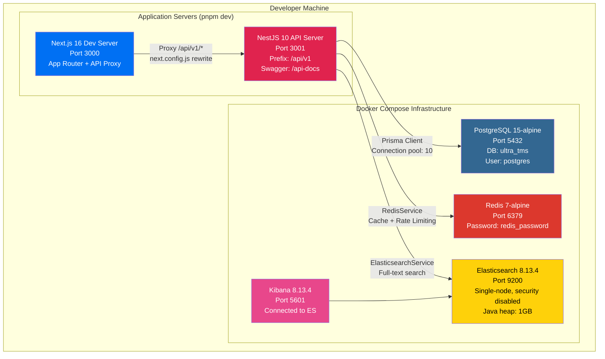
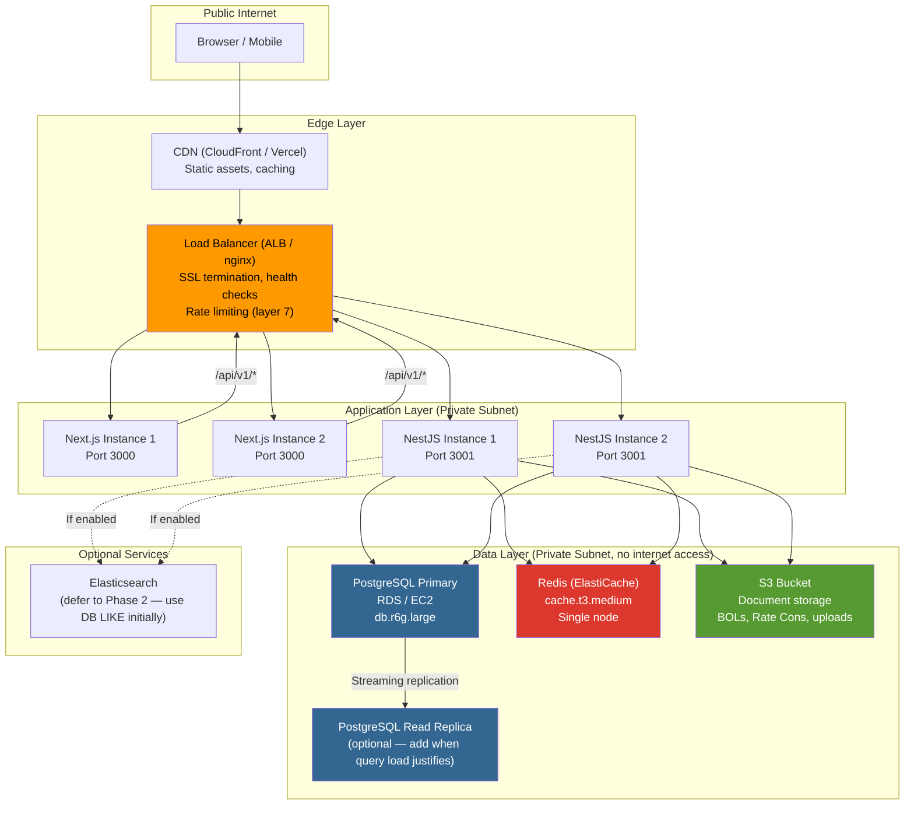

# Production Architecture

> Status: Pre-Production Design (local development only today)
> Last updated: 2026-03-09
> See also: deployment-runbook.md, observability-strategy.md

---

## Current Development Topology

All services run locally via Docker Compose + dev servers. No staging or production environment exists.



### Docker Compose Configuration (from `docker-compose.yml`)

| Service | Image | Ports | Volumes | Health Check |
|---------|-------|-------|---------|-------------|
| PostgreSQL | `postgres:15-alpine` | 5432:5432 | `postgres_data:/var/lib/postgresql/data` | `pg_isready -U postgres` (10s interval) |
| Redis | `redis:7-alpine` | 6379:6379 | `redis_data:/data` | `redis-cli ping` (10s interval) |
| Elasticsearch | `elasticsearch:8.13.4` | 9200:9200 | None (data lost on restart) | `curl -f http://localhost:9200/_cluster/health` (30s interval) |
| Kibana | `kibana:8.13.4` | 5601:5601 | None | None |

**Notable configuration:**
- ES runs with `xpack.security.enabled=false` (no auth in dev)
- ES runs with `discovery.type=single-node`
- Redis requires password (`--requirepass redis_password`)
- PostgreSQL uses init script: `scripts/init-databases.sql`
- Named volume `uploads_data` exists but is not mounted to any service

---

## Recommended Production Topology



### Minimum Viable Production (MVP Launch)

For first customer launch, a simpler topology is acceptable:

| Component | Spec | Monthly Cost (AWS estimate) |
|-----------|------|---------------------------|
| 1x API instance | t3.medium (2 vCPU, 4GB) | ~$30 |
| 1x Web instance | t3.small or Vercel Pro | ~$20 |
| RDS PostgreSQL | db.t3.medium (2 vCPU, 4GB) | ~$50 |
| ElastiCache Redis | cache.t3.micro (0.5GB) | ~$15 |
| S3 | Standard tier | ~$5 |
| ALB | Application Load Balancer | ~$20 |
| **Total** | | **~$140/month** |

**Elasticsearch is deferred** — use PostgreSQL `ILIKE` queries for search until query volume justifies ES cost (~$100/month minimum).

---

## Failure Mode Analysis

| Component | Failure Mode | Impact | Mitigation | Current State |
|-----------|-------------|--------|------------|---------------|
| **PostgreSQL down** | Full outage | All reads/writes fail, entire app unusable | Auto-failover read replica (RDS Multi-AZ) | **Not configured** — single instance, no replica |
| **Redis down** | Degraded | Cache misses (performance hit), rate limiting fails (allows unlimited requests), distributed locks fail | Graceful degradation: catch Redis errors, skip cache, use in-memory fallback for rate limiting | **Code crashes** — RedisService does not handle connection failure gracefully |
| **Elasticsearch down** | Partial | Global search and entity search unavailable | Fallback to PostgreSQL `ILIKE` queries | **No fallback exists** — search endpoints return 500 |
| **API crash** | Partial | Requests fail until restart | Multiple instances behind load balancer with health checks | **Single instance** — no auto-restart, no redundancy |
| **Next.js crash** | Full frontend outage | Users see error page | Multiple instances or Vercel auto-scaling | **Single instance** |
| **S3 unavailable** | Partial | File uploads/downloads fail | Retry with exponential backoff | **Not using S3** — local filesystem storage (`./uploads`) |
| **SendGrid down** | Partial | Email notifications (invoices, password resets) delayed | Queue emails, retry on provider recovery | **Silent failure** — emails just don't send |
| **Twilio down** | Partial | SMS notifications fail | Queue SMS, retry on provider recovery | **Silent failure** — SMS just doesn't send |
| **JWT_SECRET compromised** | Security breach | All tokens valid, full data access | Rotate secret, invalidate all sessions, forced re-login | **No rotation mechanism** — requires restart with new secret |
| **Network partition** | Varies | Inter-service communication fails | All services on same private network | **All on localhost** — not applicable in dev |

### Critical Gap: Redis Failure Handling

The `RedisService` at `apps/api/src/modules/redis/redis.service.ts` creates a Redis client on startup. If Redis is unreachable:
- The service throws on construction
- The entire NestJS app fails to start
- Rate limiting (ThrottlerModule) becomes non-functional

**Recommendation:** Add try/catch in RedisService constructor, implement `isConnected()` method, and add graceful degradation to CacheModule and rate limiting.

---

## Capacity Planning

### API Capacity

| Metric | Estimate | Basis |
|--------|----------|-------|
| Concurrent users per instance | 100-200 | NestJS single-thread (Node.js event loop) |
| Requests per second (sustained) | 500-1000 | Light DB queries, JSON serialization |
| Requests per second (peak) | 2000+ | With Redis caching, simple endpoints |
| Memory per instance | 256-512 MB | Typical NestJS + Prisma overhead |

**Scaling trigger:** When p95 latency exceeds 500ms or CPU > 70% sustained, add another API instance behind the load balancer.

### Database Capacity

| Metric | Estimate | Basis |
|--------|----------|-------|
| Prisma connection pool | Default 10 (recommend 20-50 for production) | `connection_limit` in DATABASE_URL |
| Storage per 10K loads | ~1 GB | 260 models, moderate JSON fields, no file blobs |
| Storage per year (small broker) | ~5-10 GB | 2,000-5,000 loads/year typical |
| Max concurrent connections | 100 (db.t3.medium) | PostgreSQL `max_connections` |

**Scaling trigger:** When connection pool wait time > 100ms or storage > 80% of provisioned, upgrade instance or add read replica.

### Redis Capacity

| Metric | Estimate | Basis |
|--------|----------|-------|
| Memory for rate limiting | ~10 MB | Counter keys per tenant/endpoint |
| Memory for caching | ~100-200 MB | Entity cache, dashboard data |
| Memory for distributed locks | ~5 MB | Lock keys for concurrent operations |
| Total recommended | 256-512 MB | cache.t3.micro (0.5 GB) sufficient for launch |

### Frontend Capacity

| Metric | Estimate | Basis |
|--------|----------|-------|
| Bundle size (gzipped) | ~300-500 KB | Next.js 16 + shadcn/ui + React 19 |
| Static assets | ~5-10 MB | Fonts, icons, images |
| Build time | ~60-90 seconds | Turborepo cached build |

---

## Backup Strategy

### PostgreSQL

| Aspect | Strategy | Detail |
|--------|----------|--------|
| Continuous | WAL archiving | Point-in-time recovery to any second |
| Scheduled | Daily pg_dump snapshots | Full logical backup, stored in S3 |
| Retention | 30 days (daily), 90 days (weekly) | Regulatory: financial data needs 7-year retention |
| Testing | Monthly restore test | Verify backup can be restored to a fresh instance |

```bash
# Manual backup (development)
pg_dump -h localhost -U postgres -d ultra_tms -F c -f backup_$(date +%Y%m%d).dump

# Restore
pg_restore -h localhost -U postgres -d ultra_tms_restore backup_20260309.dump
```

### Redis

| Aspect | Strategy | Detail |
|--------|----------|--------|
| RDB snapshots | Every 15 minutes | Point-in-time snapshot to disk |
| AOF (Append Only File) | Enabled for durability | Every write logged, replay on restart |
| Retention | 7 days | Redis data is ephemeral (cache), rebuild from DB |

### File Storage

| Aspect | Strategy | Detail |
|--------|----------|--------|
| Current (dev) | Local filesystem (`./uploads`) | No backup, lost on container restart |
| Production | S3 with versioning enabled | 30-day retention, lifecycle rules |
| Cross-region | S3 Cross-Region Replication (future) | For disaster recovery |

### Application Code

| Aspect | Strategy | Detail |
|--------|----------|--------|
| Source code | Git (GitHub) | Full history, branch protection |
| Configuration | `.env` files (not in git) | Stored in secrets manager (AWS SSM / Vault) |
| Infrastructure | docker-compose.yml (in git) | Infrastructure as code |

---

## Disaster Recovery

### Recovery Targets

| Target | Value | Meaning |
|--------|-------|---------|
| RTO (Recovery Time Objective) | 4 hours | Maximum time to restore full service |
| RPO (Recovery Point Objective) | 15 minutes | Maximum data loss (Redis RDB interval) |
| RTO Launch Target | 8 hours | Conservative for first deployment |

### Recovery Procedure

**Scenario: Complete infrastructure failure**

1. **Assess (15 min)**
   - Identify which components are down
   - Check health endpoints: `/api/v1/health`, `/api/v1/ready`, `/api/v1/live`
   - Check infrastructure dashboards

2. **Restore Database (1-2 hours)**
   ```bash
   # Create new PostgreSQL instance from latest backup
   # If using RDS: restore from automated snapshot
   # If using EC2: restore from pg_dump in S3
   pg_restore -h new-host -U postgres -d ultra_tms latest_backup.dump

   # Verify migration state
   pnpm --filter api prisma migrate status

   # Apply any pending migrations
   pnpm --filter api prisma migrate deploy
   ```

3. **Restore Redis (15 min)**
   ```bash
   # Redis data is ephemeral — start fresh instance
   # Cache will rebuild organically from DB queries
   # Rate limiting counters reset (acceptable)
   ```

4. **Deploy Application (30 min)**
   ```bash
   # Pull latest known-good build
   git checkout <last-known-good-tag>

   # Build and deploy
   pnpm install
   pnpm --filter api prisma:generate
   pnpm build

   # Start services
   node apps/api/dist/main.js
   pnpm --filter web start
   ```

5. **Verify (30 min)**
   - Run post-deploy smoke tests (see deployment-runbook.md)
   - Verify auth flow works
   - Verify data integrity (spot-check recent records)
   - Monitor error rate for 30 minutes

6. **Communicate (ongoing)**
   - Notify affected tenants
   - File incident report
   - Schedule post-mortem within 48 hours

---

## Network & Security

### Network Architecture (Production)

| Rule | Detail |
|------|--------|
| Public internet access | Only through Load Balancer (ports 80/443) |
| SSL/TLS | Terminated at Load Balancer (ACM certificate) |
| API to Database | Private subnet only, security group restricted |
| API to Redis | Private subnet only, security group restricted |
| Database | **NOT exposed to internet** — private subnet, no public IP |
| Redis | **NOT exposed to internet** — private subnet, no public IP |
| Elasticsearch | **NOT exposed to internet** — private subnet (if used) |
| Inter-service | All within same VPC, private subnets |
| SSH/Admin | Bastion host or AWS SSM Session Manager only |

### Current Security Configuration (from `main.ts`)

| Feature | Implementation | Status |
|---------|---------------|--------|
| CORS | `origin: ['http://localhost:3000', 'http://localhost:3002']` | **Hardcoded** — needs env var (QS-007) |
| Global auth | `JwtAuthGuard` as APP_GUARD | Active |
| Role-based access | `RolesGuard` as APP_GUARD | Active |
| Rate limiting | `ThrottlerModule` (3/1s, 20/10s, 100/60s) | Active |
| Input validation | `ValidationPipe` (whitelist, transform, forbidNonWhitelisted) | Active |
| Response serialization | `ClassSerializerInterceptor` (excludeExtraneousValues) | Active |
| Audit logging | `AuditInterceptor` | Active |
| API prefix | `/api/v1` | Active |

### Security Gaps (Known)

| Gap | Risk | Mitigation Plan |
|-----|------|-----------------|
| Tokens in localStorage | XSS can steal auth tokens | Move to httpOnly cookies (P0-001) |
| CORS hardcoded | Cannot deploy to new domains without code change | QS-007: env variable |
| No CSP headers | XSS protection gap | Add Content-Security-Policy header |
| No HSTS | Downgrade attacks possible | Add Strict-Transport-Security header |
| JWT secret not rotatable | Compromise requires restart | Add key rotation mechanism |
| No request body size limit | Large payload DoS | Add `express.json({ limit: '10mb' })` |

---

## See Also

- `deployment-runbook.md` — Step-by-step deployment procedure
- `observability-strategy.md` — Logging, metrics, alerting, SLOs
- `env-var-matrix.md` — Complete environment variable inventory
- `architecture.md` — Application architecture and caching strategy
- `security-findings.md` — Security audit results and severity framework
