# Module Dependency Graph

> Generated from `*.module.ts` imports arrays (2026-03-09)
> Source: `apps/api/src/app.module.ts` + 36 individual module files
> See also: production-architecture.md, architecture.md

---

## Mermaid Diagram

```mermaid
graph TB
    subgraph "AppModule (Root)"
        APP["AppModule<br/>app.module.ts"]
    end

    subgraph "Infrastructure (@Global)"
        style Infrastructure fill:#4a9eff,color:#fff
        AUTH["AuthModule<br/>@Global<br/>JwtModule, PassportModule"]
        EMAIL["EmailModule<br/>@Global<br/>EmailService"]
        REDIS["RedisModule<br/>@Global<br/>RedisService"]
        STORAGE["StorageModule<br/>@Global<br/>STORAGE_SERVICE"]
    end

    subgraph "Framework (imported by AppModule)"
        style Framework fill:#888,color:#fff
        CONFIG["NestConfigModule<br/>@Global (isGlobal: true)"]
        EVENT["EventEmitterModule<br/>wildcard: true"]
        THROTTLE["ThrottlerModule<br/>3 tiers: short/medium/long"]
    end

    subgraph "P0 MVP Services"
        style P0 fill:#22c55e,color:#fff
        CRM["CrmModule"]
        SALES["SalesModule"]
        TMS["TmsModule"]
        CARRIER["CarrierModule"]
        ACCOUNTING["AccountingModule"]
        LOADBOARD["LoadBoardModule"]
        COMMISSION["CommissionModule"]
        CUSTPORTAL["CustomerPortalModule<br/>JwtModule (PORTAL_JWT_SECRET)"]
        OPS["OperationsModule<br/>6 sub-modules"]
    end

    subgraph "P1 Post-MVP"
        style P1 fill:#f59e0b,color:#000
        DOCS["DocumentsModule"]
        COMM["CommunicationModule<br/>ConfigModule"]
        CARRPORTAL["CarrierPortalModule<br/>JwtModule (CARRIER_PORTAL_JWT_SECRET)"]
    end

    subgraph "P2 Extended"
        style P2 fill:#a855f7,color:#fff
        CLAIMS["ClaimsModule"]
        CONTRACTS["ContractsModule"]
        AGENTS["AgentsModule"]
        CREDIT["CreditModule"]
        FACTORING["FactoringModule"]
        ANALYTICS["AnalyticsModule"]
        WORKFLOW["WorkflowModule"]
        INTHUB["IntegrationHubModule"]
        SEARCH["SearchModule<br/>ElasticsearchModule"]
    end

    subgraph "P3 Future"
        style P3 fill:#64748b,color:#fff
        HR["HrModule"]
        SCHEDULER["SchedulerModule"]
        SAFETY["SafetyModule"]
        EDI["EdiModule"]
        HELPDESK["HelpDeskModule"]
        FEEDBACK["FeedbackModule"]
        RATEINTEL["RateIntelligenceModule"]
        AUDIT["AuditModule"]
        CONFIGMOD["ConfigModule (app)"]
        CACHE["CacheModule"]
    end

    subgraph "Standalone"
        HEALTH["HealthModule<br/>PrismaService only"]
    end

    %% AppModule imports everything
    APP --> AUTH
    APP --> EMAIL
    APP --> REDIS
    APP --> STORAGE
    APP --> CONFIG
    APP --> EVENT
    APP --> THROTTLE

    %% Explicit module imports (from imports: arrays)
    CACHE -->|"imports"| REDIS
    CACHE -->|"imports"| EVENT
    COMM -->|"imports"| CONFIG
    SEARCH -->|"imports"| SEARCH_ES["ElasticsearchModule"]
    SALES -->|"imports"| EVENT
    TMS -->|"imports"| EVENT
    FEEDBACK -->|"imports"| EVENT
    HELPDESK -->|"imports"| EVENT
    HR -->|"imports"| EVENT
    CUSTPORTAL -->|"imports"| JWT_CP["JwtModule"]
    CARRPORTAL -->|"imports"| JWT_CAP["JwtModule"]
    OPS -->|"imports"| OPS_SUB["6 sub-modules:<br/>LoadPlannerQuotes<br/>Carriers<br/>LoadHistory<br/>Equipment<br/>InlandServiceTypes<br/>Dashboard"]

    %% @Global modules are implicitly available to all
    AUTH -.->|"@Global: available everywhere"| CRM
    AUTH -.->|"@Global"| SALES
    AUTH -.->|"@Global"| TMS
    EMAIL -.->|"@Global: available everywhere"| AUTH
    REDIS -.->|"@Global: available everywhere"| CACHE
    STORAGE -.->|"@Global: available everywhere"| DOCS
```



---

## @Global() Modules

Four modules are decorated with `@Global()`, making their exported services available to all other modules without explicit import.

| Module | Decorator | Provides | Export | File |
|--------|-----------|----------|--------|------|
| AuthModule | `@Global()` | JwtAuthGuard, JwtStrategy, UsersService, RolesService, AuthService, TenantService, ProfileService, MfaService | UsersService, RolesService, AuthService, TenantService, ProfileService, MfaService | `auth/auth.module.ts` |
| EmailModule | `@Global()` | EmailService | EmailService | `email/email.module.ts` |
| RedisModule | `@Global()` | RedisService | RedisService | `redis/redis.module.ts` |
| StorageModule | `@Global()` | STORAGE_SERVICE (factory) | STORAGE_SERVICE | `storage/storage.module.ts` |

Additionally, `NestConfigModule.forRoot({ isGlobal: true })` makes `ConfigService` globally available.

---

## Explicit Module Dependencies (from `imports:` arrays)

Most modules have **no explicit imports** -- they only use PrismaService (injected directly) and @Global services (available without import). The following modules have explicit `imports:` arrays:

| Module | Imports | Purpose |
|--------|---------|---------|
| CacheModule | `RedisModule`, `EventEmitterModule` | Redis for cache storage, events for invalidation |
| CommunicationModule | `ConfigModule` (NestJS) | Access to env vars for SendGrid/Twilio keys |
| CustomerPortalModule | `JwtModule.register()` | Separate JWT signing with `PORTAL_JWT_SECRET` |
| CarrierPortalModule | `JwtModule.register()` | Separate JWT signing with `CARRIER_PORTAL_JWT_SECRET` |
| AuthModule | `PassportModule`, `JwtModule.registerAsync()` | JWT strategy with `JWT_SECRET` via ConfigService |
| SearchModule | `ElasticsearchModule` | Elasticsearch client for full-text search |
| OperationsModule | 6 sub-modules | LoadPlannerQuotes, Carriers, LoadHistory, Equipment, InlandServiceTypes, Dashboard |
| SalesModule | `EventEmitterModule` | Quote lifecycle events |
| TmsModule | `EventEmitterModule` | Load/order status change events |
| FeedbackModule | `EventEmitterModule` | NPS survey events |
| HelpDeskModule | `EventEmitterModule` | Ticket escalation events |
| HrModule | `EventEmitterModule` | Time-off approval events |

### Modules with NO explicit imports (use only PrismaService + @Global)

AccountingModule, AgentsModule, AnalyticsModule, AuditModule, CarrierModule, ClaimsModule, CommissionModule, ConfigModule (app), ContractsModule, CreditModule, CrmModule, DocumentsModule, EdiModule, FactoringModule, HealthModule, IntegrationHubModule, LoadBoardModule, RateIntelligenceModule, SafetyModule, SchedulerModule, WorkflowModule

---

## Dual-Module Pattern: Carrier vs Operations/Carriers

Two separate modules manage carrier-related functionality:

| Module | Path | Scope | Endpoints |
|--------|------|-------|-----------|
| CarrierModule | `modules/carrier/` | Core carrier CRUD (carriers, drivers, insurances, contacts, documents) | `/api/v1/carriers/*` |
| Operations/CarriersModule | `modules/operations/carriers/` | Operational carrier views (performance, scoring, dispatch-related queries) | `/api/v1/operations/carriers/*` |

**CarrierModule** is a top-level module imported directly by AppModule. **Operations/CarriersModule** is a sub-module imported by OperationsModule. They share the same database models but serve different use cases.

### OperationsModule Sub-Module Structure

```
OperationsModule
  +-- LoadPlannerQuotesModule   (load planner + quote management)
  +-- CarriersModule            (operational carrier views)
  +-- LoadHistoryModule         (load history queries)
  +-- EquipmentModule           (equipment/trailer management)
  +-- InlandServiceTypesModule  (inland service type lookups)
  +-- DashboardModule           (operational dashboard KPIs)
  +-- TruckTypesController      (truck type CRUD — direct, not sub-module)
```

---

## Module Export Analysis

Modules that export services (allowing other modules to use them if they import the module):

| Module | Exports |
|--------|---------|
| AuthModule | UsersService, RolesService, AuthService, TenantService, ProfileService, MfaService |
| CarrierModule | CarriersService, DriversService, InsurancesService, ContactsService, DocumentsService |
| CrmModule | CompaniesService, ContactsService, OpportunitiesService, ActivitiesService, HubspotService |
| SalesModule | QuotesService, RateContractsService, AccessorialRatesService, SalesPerformanceService, RateCalculationService |
| TmsModule | OrdersService, LoadsService, StopsService, TrackingService |
| CommissionModule | CommissionPlansService, CommissionEntriesService, CommissionPayoutsService, CommissionsDashboardService |
| DocumentsModule | DocumentsService, DocumentTemplatesService, DocumentFoldersService |
| CreditModule | All 5 services |
| ClaimsModule | ClaimsService, ClaimItemsService (partial) |
| FactoringModule | All 6 services |
| OperationsModule | All 6 sub-modules + TruckTypesService |
| SchedulerModule | JobsService, JobSchedulerService, HandlerRegistry |
| EmailModule | EmailService (@Global) |
| RedisModule | RedisService (@Global) |
| StorageModule | STORAGE_SERVICE (@Global) |

Modules that export **nothing** (fully self-contained):

AccountingModule, AgentsModule, AnalyticsModule, AuditModule, CacheModule, CarrierPortalModule, CommunicationModule, ConfigModule (app), ContractsModule, CustomerPortalModule, EdiModule, FeedbackModule, HealthModule, HelpDeskModule, HrModule, IntegrationHubModule, LoadBoardModule, RateIntelligenceModule, SafetyModule, SearchModule, WorkflowModule

---

## APP_GUARD and APP_INTERCEPTOR (Global Providers)

Registered in `app.module.ts` providers array, these apply to ALL routes:

| Type | Class | Purpose |
|------|-------|---------|
| APP_GUARD | JwtAuthGuard | JWT authentication on all endpoints (except @Public) |
| APP_GUARD | RolesGuard | Role-based access control |
| APP_GUARD | CustomThrottlerGuard | Rate limiting (3 tiers) |
| APP_INTERCEPTOR | ResponseTransformInterceptor | Wraps all responses in `{ data: T }` envelope |
| APP_INTERCEPTOR | AuditInterceptor | Logs entity mutations to audit trail |

---

## Global Middleware

Applied to all routes via `AppModule.configure()`:

| Middleware | Purpose |
|------------|---------|
| CorrelationIdMiddleware | Adds `x-correlation-id` header for request tracing |
| RequestLoggingMiddleware | Logs request method, path, status code, response time |

---

## EventEmitter Consumers

The following modules use `EventEmitterModule` for event-driven communication:

| Module | Events Emitted | Events Consumed |
|--------|---------------|-----------------|
| SalesModule | `quote.created`, `quote.updated` | — |
| TmsModule | `order.created`, `load.status_changed` | — |
| AuditModule | — | `*.created`, `*.updated`, `*.deleted` (wildcard) |
| CacheModule | — | Cache invalidation events |
| FeedbackModule | `nps.completed`, `survey.submitted` | — |
| HelpDeskModule | `ticket.escalated`, `sla.breached` | — |
| HrModule | `timeoff.requested`, `timeoff.approved` | — |
| ContractsModule | `contract.signed`, `contract.expired` | — |

**Note:** `EventEmitterModule.forRoot({ wildcard: true, delimiter: '.' })` is configured in AppModule, enabling the AuditModule's wildcard listener pattern.

---

## See Also

- `production-architecture.md` -- Infrastructure topology
- `architecture.md` -- Application architecture overview
- `env-var-matrix.md` -- Environment variables used by each module
- `data-flow.md` -- Cross-service data flow patterns
