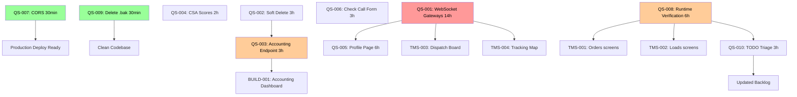

# Dependency Graph — Quality Sprint

> Generated by: DEPENDENCY-GRAPHER analysis
> Last updated: 2026-03-07
> Sprint: Quality Sprint (QS-001 through QS-010)

---

## Critical Path Analysis

The critical path is the longest chain of dependent tasks. It determines the minimum sprint duration.

```
QS-007 (30min) → [enables all API calls to work in production]
QS-003 (3h) → BUILD-001 (accounting dashboard screen)
QS-001 (14h) → QS-005 (notifications) → [real-time features]
QS-008 (6h) → TMS-001/002 (TMS Core screens) → [accurate backlog]
```

**Longest chain:** QS-007 → QS-003 → BUILD-001 = 30min + 3h + 6h = 9.5h
**Longest chain:** QS-001 = 14h (standalone — no blockers, no dependents in this sprint)

**Critical path tasks (in sprint):** QS-001 (14h), QS-008 (6h), QS-003 (3h)

---

## Dependency Table

| Task | Blocked By | Blocks | Can Parallelize With |
|------|-----------|--------|---------------------|
| QS-007 | Nothing | Nothing (but enables prod deploy) | Everything |
| QS-009 | Nothing | Nothing | Everything |
| QS-004 | Nothing | Nothing | QS-001, QS-002, QS-003, QS-006, QS-007, QS-008, QS-009, QS-010 |
| QS-010 | QS-008 (preferred) | Nothing (updates backlog) | QS-001, QS-002, QS-003, QS-004, QS-005, QS-006, QS-007, QS-009 |
| QS-002 | Nothing | QS-003 (minor) | QS-001, QS-004, QS-006, QS-007, QS-008, QS-009, QS-010 |
| QS-003 | QS-002 (soft delete — preferred order) | BUILD-001 to BUILD-007 | QS-001, QS-004, QS-006, QS-007, QS-008 |
| QS-006 | Nothing | Nothing | Everything |
| QS-008 | pnpm dev running | TMS-001 to TMS-005, QS-010 | QS-001, QS-002, QS-003, QS-004, QS-006, QS-007, QS-009 |
| QS-005 | Nothing (but QS-001 needed for notifications) | Nothing | QS-002, QS-003, QS-004, QS-006, QS-007, QS-008, QS-009, QS-010 |
| QS-001 | Nothing | QS-005 (notifications), TMS-003/004 | QS-002, QS-003, QS-004, QS-005, QS-006, QS-007, QS-008, QS-009, QS-010 |

---

## Dependency DAG (Mermaid)



---

## Parallelization Opportunities

### Week 1 — Can Run Simultaneously
| Parallel Group | Tasks | Total Hours |
|---------------|-------|-------------|
| Quick wins | QS-007, QS-009 | 1h |
| Endpoint fixes | QS-002, QS-003, QS-004 | 7h |
| Form fixes | QS-006 | 3h |

**Claude Code does:** QS-002, QS-003 (sequential, QS-002 first)
**Codex/Gemini does:** QS-007, QS-009, QS-004, QS-006 (parallel)

### Week 2 — Sequential
| Task | After | Hours |
|------|-------|-------|
| QS-008 | Dev environment running | 6h |
| QS-010 | QS-008 complete (preferred) | 3h |

### Week 3 — Large Task
| Task | After | Hours |
|------|-------|-------|
| QS-001 | Nothing — can start Week 1 | 14h |

### Week 4 — UX Polish
| Task | After | Hours |
|------|-------|-------|
| QS-005 | QS-001 (for notifications section) | 6h |

---

## Structural Issues

| Issue Type | Details | Resolution |
|-----------|---------|------------|
| Bottleneck tasks | None in this sprint | N/A |
| Orphan tasks | None | N/A |
| Circular dependencies | None found | N/A |
| Long chains | QS-001 → QS-005 (2 deep) | Acceptable |

**Graph is valid:** No circular dependencies, no orphan tasks, no bottlenecks.

---

## Total Sprint Hours

| Category | Tasks | Hours |
|----------|-------|-------|
| Quick wins (S) | QS-007, QS-009, QS-004 | 4h |
| Medium (M) | QS-002, QS-003, QS-006, QS-010 | 12h |
| Large (L) | QS-005, QS-008 | 12h |
| XL | QS-001 | 14h |
| **Total** | **10 tasks** | **~42h** |

At 2 developers × 15h/week = 30h/week capacity → **~1.5 week sprint** (with parallelization)
