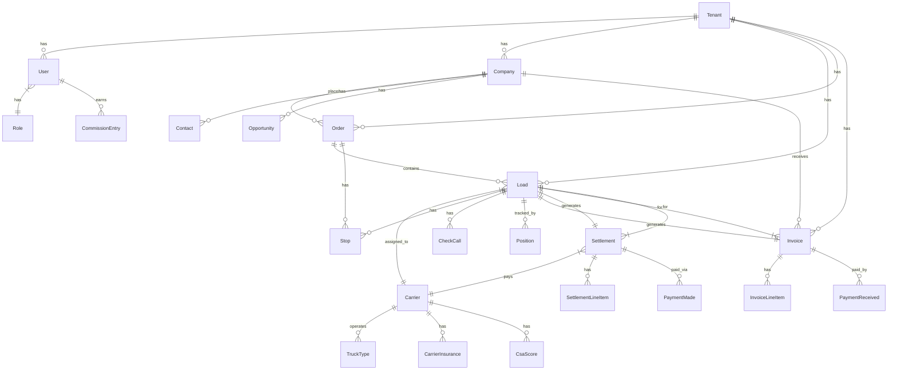

# Prisma Schema Documentation — Ultra TMS

> Last updated: 2026-03-07
> Source: `apps/api/prisma/schema.prisma`
> Format: DATABASE-DOC-GENERATOR format
> Counts: 260 models, 114 enums, 31 migrations

---

## Overview

```
schema.prisma location: apps/api/prisma/schema.prisma
Database: PostgreSQL 15 (Docker: postgres:15-alpine)
ORM: Prisma 6
Client output: apps/api/src/generated/prisma/
Shadow database: Used for migration validation
```

---

## High-Level ERD (Core Entities)



---

## Key Models — Full Documentation

### Tenant

```prisma
model Tenant {
  id          String         @id @default(cuid())
  name        String
  slug        String         @unique
  plan        TenantPlan     @default(STARTER)
  status      TenantStatus   @default(ACTIVE)
  settings    Json?
  createdAt   DateTime       @default(now())
  updatedAt   DateTime       @updatedAt

  users         User[]
  companies     Company[]
  tenantConfig  TenantConfig?
  services      TenantService[]
}
```
**Notes:** Root of multi-tenant isolation. Every other entity has a `tenantId` foreign key to this.

---

### User

```prisma
model User {
  id            String    @id @default(cuid())
  tenantId      String
  email         String    @unique
  passwordHash  String
  firstName     String
  lastName      String
  roleId        String
  mfaEnabled    Boolean   @default(false)
  mfaSecret     String?
  isActive      Boolean   @default(true)
  deletedAt     DateTime?
  createdAt     DateTime  @default(now())
  updatedAt     DateTime  @updatedAt

  tenant        Tenant    @relation(...)
  role          Role      @relation(...)
  sessions      Session[]
  auditLogs     AuditLog[]
}
```
**Indexes:** `@@index([tenantId])`, `@@index([email])`

---

### Order

```prisma
model Order {
  id            String      @id @default(cuid())
  tenantId      String
  customerId    String
  orderNumber   String      @unique
  status        OrderStatus @default(PENDING)
  totalAmount   Decimal     @db.Decimal(10,2)
  currency      String      @default("USD")
  externalId    String?
  customFields  Json?
  deletedAt     DateTime?
  createdAt     DateTime    @default(now())
  updatedAt     DateTime    @updatedAt

  tenant        Tenant      @relation(...)
  customer      Company     @relation(...)
  loads         Load[]
  orderItems    OrderItem[]
}
```
**Important:** `deletedAt` is NOT present in all Orders — QS-002 adds soft delete migration.

---

### Load

```prisma
model Load {
  id            String      @id @default(cuid())
  tenantId      String
  orderId       String
  carrierId     String?
  loadNumber    String      @unique
  status        LoadStatus  @default(AVAILABLE)
  pickupDate    DateTime
  deliveryDate  DateTime
  rate          Decimal     @db.Decimal(10,2)
  carrierRate   Decimal?    @db.Decimal(10,2)
  externalId    String?
  deletedAt     DateTime?
  createdAt     DateTime    @default(now())
  updatedAt     DateTime    @updatedAt

  tenant        Tenant      @relation(...)
  order         Order       @relation(...)
  carrier       Carrier?    @relation(...)
  stops         Stop[]
  checkCalls    CheckCall[]
  positions     Position[]
}
```
**Business rule:** Once `status = PICKED_UP`, carrier cannot be changed.

---

### Stop

```prisma
model Stop {
  id            String      @id @default(cuid())
  loadId        String
  orderId       String?
  sequence      Int
  type          StopType
  locationId    String
  scheduledAt   DateTime
  arrivedAt     DateTime?
  departedAt    DateTime?
  status        StopStatus  @default(PENDING)
  notes         String?

  load          Load        @relation(...)
  location      Location    @relation(...)
}
```

---

### Carrier

```prisma
model Carrier {
  id              String        @id @default(cuid())
  tenantId        String
  name            String
  dotNumber       String        @unique
  mcNumber        String?       @unique
  status          CarrierStatus @default(PENDING)
  insuranceExpiry DateTime?
  preferredStatus Boolean       @default(false)
  externalId      String?
  deletedAt       DateTime?
  createdAt       DateTime      @default(now())
  updatedAt       DateTime      @updatedAt

  tenant          Tenant        @relation(...)
  loads           Load[]
  insurance       CarrierInsurance[]
  documents       CarrierDocument[]
  contacts        CarrierContact[]
  truckTypes      TruckType[]
  csaScores       CsaScore[]
}
```
**Status machine:** PENDING → ACTIVE → SUSPENDED/BLACKLISTED. BLACKLISTED is permanent.

---

### Invoice

```prisma
model Invoice {
  id            String        @id @default(cuid())
  tenantId      String
  loadId        String        @unique
  customerId    String
  invoiceNumber String        @unique
  status        InvoiceStatus @default(DRAFT)
  amount        Decimal       @db.Decimal(10,2)
  dueDate       DateTime
  paidAt        DateTime?
  externalId    String?
  deletedAt     DateTime?     // QS-002 — may be missing, add migration
  createdAt     DateTime      @default(now())
  updatedAt     DateTime      @updatedAt

  tenant        Tenant        @relation(...)
  load          Load          @relation(...)
  customer      Company       @relation(...)
  lineItems     InvoiceLineItem[]
  payments      PaymentReceived[]
}
```

---

## Database Patterns

### Pattern 1: Multi-Tenant Isolation (MANDATORY)

Every model has `tenantId`. Every query MUST filter by tenantId:

```typescript
// CORRECT — always filter by tenantId
await prisma.carrier.findMany({
  where: { tenantId, deletedAt: null }
});

// WRONG — data leak across tenants
await prisma.carrier.findMany(); // ← NEVER do this
```

---

### Pattern 2: Soft Delete (on all core entities)

Core entities use `deletedAt DateTime?` for soft delete:

```typescript
// Find active records
await prisma.company.findMany({ where: { tenantId, deletedAt: null } });

// Soft delete
await prisma.company.update({
  where: { id },
  data: { deletedAt: new Date() }
});

// Hard delete (never use on core entities)
// await prisma.company.delete({ where: { id } }); // ← NEVER
```

**Entities missing soft delete (QS-002):** Order, Quote, Invoice, Settlement, Payment

---

### Pattern 3: Standard Timestamps

All models include:
```prisma
createdAt   DateTime  @default(now())
updatedAt   DateTime  @updatedAt
```

---

### Pattern 4: Integration/Extensibility Fields

Most core entities include:
```prisma
externalId    String?   // ID in external system (QuickBooks, ERP, TMS)
sourceSystem  String?   // Which system created this record
customFields  Json?     // Tenant-specific extra fields
```

---

### Pattern 5: Audit Trail

Sensitive operations write to `AuditLog`:
```typescript
await this.auditService.log({
  tenantId,
  userId,
  action: 'DELETE',
  resource: 'Carrier',
  resourceId: carrier.id,
  changes: { before: carrier, after: null },
});
```

---

## Schema Issues (Known Problems)

| Issue | Severity | Models Affected | Task |
|-------|----------|----------------|------|
| Missing soft delete | HIGH | Order, Quote, Invoice, Settlement, PaymentMade, PaymentReceived | QS-002 |
| Missing CSA score real data | MEDIUM | CsaScore | QS-004 |
| No accounting dashboard aggregation view | MEDIUM | Invoice, Settlement, Payment | QS-003 |
| Some relations may lack proper indexes | LOW | Various junction tables | Backlog |
| No composite unique constraint on tenantId+externalId | LOW | Most entities | Backlog |

---

## Migration History (31 migrations)

Migrations location: `apps/api/prisma/migrations/`

**Note:** Full migration list available via:
```bash
ls apps/api/prisma/migrations/
```

Key milestone migrations (estimated based on feature development):
- Initial schema: Auth, Tenant, Role models
- CRM: Company, Contact, Opportunity models
- TMS Core: Order, Load, Stop, CheckCall models
- Carriers: Carrier, TruckType, Insurance models
- Accounting: Invoice, Settlement, Payment models
- LoadPlanner: All LoadPlanner* models
- P1 foundations: Claim, Document, Contract models
- P2 foundations: Agent, Credit, Factoring models
- P3 foundations: EDI, Safety, HR, Scheduler models

---

## Prisma Client Usage

```typescript
// Import (in NestJS modules)
import { PrismaService } from '../prisma/prisma.service';

// All queries pattern:
const results = await this.prisma.carrier.findMany({
  where: {
    tenantId,           // REQUIRED
    deletedAt: null,    // REQUIRED (soft delete)
    // ... other filters
  },
  include: { insurance: true },
  orderBy: { createdAt: 'desc' },
  skip: (page - 1) * limit,
  take: limit,
});

// Count for pagination:
const total = await this.prisma.carrier.count({
  where: { tenantId, deletedAt: null }
});
```

---

## Commands

```bash
# Generate Prisma client after schema changes
pnpm --filter api prisma:generate

# Create and run migration
pnpm --filter api prisma:migrate

# Reset database (dev only — destroys data)
pnpm --filter api exec prisma migrate reset

# Explore data
pnpm --filter api prisma:studio

# Seed
pnpm --filter api prisma:seed
```
