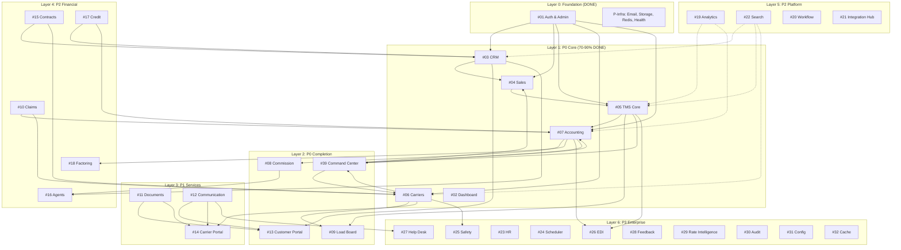

# Master Project Plan — Ultra TMS (All 39 Services)

> **Scope:** 39 services, 24 sprints, 5 phases, ~48 weeks
> **Start Date:** 2026-03-10 (Week 1 = Sprint MP-01)
> **Last Updated:** 2026-03-13
> **Replaces:** `roadmap-phases.md` (16-week MVP-only plan)
> **Companion Files:** [STATUS.md](../STATUS.md) | [REMEDIATION-ROADMAP.md](../05-audit/REMEDIATION-ROADMAP.md) | [\_CONSOLIDATED-VERDICTS.md](../05-audit/tribunal/per-service/_CONSOLIDATED-VERDICTS.md)

---

## 1. Executive Summary

Ultra TMS is a multi-tenant 3PL logistics platform with **39 services** across 5 tiers. This plan maps every service into a dependency-ordered sequence of 2-week sprints from current state to General Availability.

**Current State (2026-03-13):**

- MP-01 ✅ COMPLETE (30/30 tasks)
- MP-02 ✅ COMPLETE (15/15 tasks)
- MP-03 ✅ COMPLETE (11/11 tasks)
- Backend: ~90% built for P0 (1,230 endpoints, 260 Prisma models)
- Frontend: ~70-80% built for P0 (103 routes, 304 components)
- P1-P3 backend: "Substantial" (endpoints exist, many stubs)
- P1-P3 frontend: 0% built
- Tests: 100+ passing (8.7% FE, ~15% BE; +13 backend tests in MP-03)
- Production readiness: 3.0/10

**Service Inventory:**

| Tier        | Count | Services                                                                                                                                                                               |
| ----------- | ----- | -------------------------------------------------------------------------------------------------------------------------------------------------------------------------------------- |
| P0 MVP      | 11    | Auth (#01), Dashboard (#02), CRM (#03), Sales (#04), TMS Core (#05), Carriers (#06), Accounting (#07), Commission (#08), Load Board (#09), Customer Portal (#13), Command Center (#39) |
| P1 Post-MVP | 3     | Documents (#11), Communication (#12), Carrier Portal (#14)                                                                                                                             |
| P2 Extended | 9     | Claims (#10), Contracts (#15), Agents (#16), Credit (#17), Factoring (#18), Analytics (#19), Workflow (#20), Integration Hub (#21), Search (#22)                                       |
| P3 Future   | 10    | HR (#23), Scheduler (#24), Safety (#25), EDI (#26), Help Desk (#27), Feedback (#28), Rate Intelligence (#29), Audit (#30), Config (#31), Cache (#32)                                   |
| P-Infra     | 6     | Super Admin (#33), Email (#34), Storage (#35), Redis (#36), Health (#37), Operations (#38)                                                                                             |

---

## 2. Phase Overview

```
Phase 1: MVP COMPLETION          Phase 2: CORE EXPANSION           Phase 3: PLATFORM SERVICES
Wk 01-02 ████ MP-01 Security     Wk 13-14 ████ MP-07 Docs+Comms    Wk 25-26 ████ MP-13 Analytics+Search
Wk 03-04 ████ MP-02 Table-Stakes Wk 15-16 ████ MP-08 Portals Full  Wk 27-28 ████ MP-14 Workflow+IntHub
Wk 05-06 ████ MP-03 Testing      Wk 17-18 ████ MP-09 Claims+Cntrs  Wk 29-30 ████ MP-15 Portals+LoadBrd
Wk 07-08 ████ MP-04 DevOps       Wk 19-20 ████ MP-10 Agents+Crdt   Wk 31-32 ████ MP-16 CmdCenter Full
Wk 09-10 ████ MP-05 CmdCenter    Wk 21-22 ████ MP-11 Factor+Comm   Wk 33-34 ████ MP-17 Audit+Config
Wk 11-12 ████ MP-06 Beta Launch  Wk 23-24 ████ MP-12 Stabilize     Wk 35-36 ████ MP-18 Stabilize
         ▲ G1: MVP Beta                   ▲ G2: Core Expansion               ▲ G3: Platform Release

Phase 4: ENTERPRISE              Phase 5: MATURITY
Wk 37-38 ████ MP-19 EDI+Safety   Wk 45-46 ████ MP-23 Hardening
Wk 39-40 ████ MP-20 HR+Scheduler Wk 47-48 ████ MP-24 GA Launch
Wk 41-42 ████ MP-21 HelpDsk+Fdbk          ▲ G5: General Availability
Wk 43-44 ████ MP-22 RateInt+Cache
         ▲ G4: Enterprise Release
```

---

## 3. Service Dependency Graph



**Critical Path:** Auth → TMS Core → Accounting → Commission → Agents (longest functional chain)
**Launch Critical Path:** Security (MP-01) → Table-Stakes (MP-02) → Testing (MP-03) → DevOps (MP-04) → Beta (MP-06)

---

## 4. Task Naming Convention

**Per-sprint tasks:** `MP-{sprint}-{seq}` (e.g., `MP-01-001`)
**Per-service tasks (backlog):** Existing prefixes retained:

- `QS-` Quality Sprint | `CC-` Command Center | `SEC-` Security | `TEST-` Testing
- `P1S-` P1 screens | `P2S-` P2 screens | `P3F-` P3 future
- `BLD-` Build screens | `BACK-` Backend | `INFRA-` Infrastructure
- `ACC-` Accessibility | `PERF-` Performance | `UX-` UX polish

**5-Layer Per-Service Breakdown:**
Every service entering a sprint gets work across 5 layers:

| Layer  | Code | Scope                                                            | Typical Effort |
| ------ | ---- | ---------------------------------------------------------------- | -------------- |
| Verify | VER  | Runtime endpoint verification, response envelope check           | 1-3h           |
| Secure | SEC  | RolesGuard, tenant isolation, soft-delete, credential encryption | 2-6h           |
| Build  | BLD  | Frontend screens from design specs, hooks, wiring                | 4-16h          |
| Wire   | WIR  | Cross-service integration, events, crons, WebSocket              | 2-4h           |
| Test   | TST  | Unit + integration + E2E tests (min 20% coverage per service)    | 3-8h           |

---

## 5. Phase 1: MVP Completion (MP-01 to MP-06, Weeks 1-12)

### MP-01: Security Hardening (Weeks 1-2)

**Goal:** Close ALL STOP-SHIP security items. No production deployment without this.
**Services touched:** All P0 + all P-Infra
**Absorbs:** SEC-001–008, REMEDIATION-ROADMAP S4, QS-007 (DONE), QS-014 (DONE)

| ID        | Task                                                                                                                      | Layer | Effort | Priority | Source          |
| --------- | ------------------------------------------------------------------------------------------------------------------------- | ----- | ------ | -------- | --------------- |
| MP-01-001 | ~~QS-014: Prisma Client Extension for auto tenantId + deletedAt~~                                                         | SEC   | 8h     | P0       | **DONE**        |
| MP-01-002 | ~~Fix RolesGuard gaps — financial controllers (Accounting 10, Credit 5, Contracts 8, Factoring 5, Agents 6)~~             | SEC   | 4h     | P0       | **DONE**        |
| MP-01-003 | ~~Fix RolesGuard gaps — data-modifying controllers (Config 9, Audit 8, Load Board 9, HR 6, Scheduler 5, Safety 9)~~       | SEC   | 6h     | P0       | **DONE**        |
| MP-01-004 | ~~Fix RolesGuard gaps — remaining controllers (Help Desk 5, Feedback 5, Cache 4, EDI 5, Search 4, Workflow 4, Claims 7)~~ | SEC   | 4h     | P1       | **DONE**        |
| MP-01-005 | Fix JWT secret inconsistency — Customer Portal (PORTAL_JWT_SECRET vs CUSTOMER_PORTAL_JWT_SECRET)                          | SEC   | 30min  | P0       | PST-13          |
| MP-01-006 | Fix Carrier Portal login tenant isolation (add tenantId to login query)                                                   | SEC   | 30min  | P0       | PST-14          |
| MP-01-007 | Fix plaintext credentials — Factoring apiKey (@Exclude or select clause)                                                  | SEC   | 1h     | P0       | PST-18          |
| MP-01-008 | Fix Integration Hub EncryptionService hardcoded fallback key (fail-fast in production)                                    | SEC   | 1h     | P0       | PST-21          |
| MP-01-009 | Fix plaintext credentials — Rate Intelligence (encrypt apiKey, apiSecret, password)                                       | SEC   | 2h     | P0       | PST-29          |
| MP-01-010 | Fix plaintext credentials — EDI ftpPassword (encrypt + @Exclude on response)                                              | SEC   | 1h     | P0       | PST-26          |
| MP-01-011 | Fix Elasticsearch queries — add tenantId filtering in Search service                                                      | SEC   | 2h     | P0       | PST-22, CCF-036 |
| MP-01-012 | Fix Cache 8/20 endpoints missing tenantId                                                                                 | SEC   | 2h     | P0       | PST-32, CCF-036 |
| MP-01-013 | Fix Operations LoadHistory 2 tenant bugs (getByCarrier + getSimilarLoads)                                                 | SEC   | 1h     | P0       | PST-38, CCF-034 |
| MP-01-014 | Fix CRM tenant isolation in mutations (4 services)                                                                        | SEC   | 2h     | P0       | PST-03, CCF-004 |
| MP-01-015 | Fix Accounting 4 cross-tenant bugs in PaymentReceived                                                                     | SEC   | 2h     | P0       | PST-07, CCF-021 |
| MP-01-016 | Fix Sales tenant isolation in mutations (Quotes, RateContracts, AccessorialRates)                                         | SEC   | 2h     | P0       | PST-04, CCF-004 |
| MP-01-017 | Fix Contracts FuelSurchargeTier missing tenantId (migration + backfill)                                                   | SEC   | 1h     | P0       | PST-15          |
| MP-01-018 | Fix Agents rankings tenant leak                                                                                           | SEC   | 30min  | P0       | PST-16          |
| MP-01-019 | Fix Search deleteSynonym cross-tenant bug                                                                                 | SEC   | 30min  | P0       | PST-22          |
| MP-01-020 | Fix Super Admin deleted admin auth (add deletedAt filter)                                                                 | SEC   | 15min  | P0       | PST-33          |
| MP-01-021 | Migrate localStorage tokens to HttpOnly cookies                                                                           | SEC   | 4h     | P0       | P0-001          |
| MP-01-022 | ~~Fix CORS env variable (QS-007)~~                                                                                        | SEC   | 30min  | P1       | **DONE**        |
| MP-01-023 | Add CSP headers to Next.js config                                                                                         | SEC   | 2h     | P1       | S4-23           |
| MP-01-024 | Add @nestjs/throttler rate limiting (auth: 5/min, API: 100/min)                                                           | SEC   | 2h     | P1       | S4-24           |
| MP-01-025 | Fix webhook auth — Communication SMS (@Public + Twilio signature validation)                                              | SEC   | 2h     | P1       | PST-12, CCF-030 |
| MP-01-026 | Fix webhook auth — CRM HubSpot (disable or authenticate)                                                                  | SEC   | 1h     | P1       | PST-03, CCF-030 |
| MP-01-027 | Fix Storage path traversal vulnerability (path.resolve + startsWith check)                                                | SEC   | 1h     | P2       | PST-35          |
| MP-01-028 | Fix Redis KEYS command — replace with SCAN iterator in 4 methods                                                          | SEC   | 2h     | P2       | PST-36          |
| MP-01-029 | Verify CSRF protection (SameSite cookie attribute)                                                                        | SEC   | 30min  | P2       | S4-29           |
| MP-01-030 | Add gitleaks pre-commit hook                                                                                              | SEC   | 1h     | P2       | S4-30           |

**Exit Criteria:**

- [ ] Zero STOP-SHIP items in SECURITY-REMEDIATION.md
- [ ] All financial controllers have RolesGuard
- [ ] All credentials encrypted at rest
- [ ] Tenant isolation verified on all CRUD mutation paths
- [ ] HttpOnly cookie auth working

---

### MP-02: Table-Stakes Features + Revenue Lifecycle (Weeks 3-4)

**Goal:** Build features any TMS customer expects on day one. Wire the 12-step revenue lifecycle.
**Services touched:** TMS Core (#05), Accounting (#07), Commission (#08), Customer Portal (#13), Documents (#11), Sales (#04)
**Absorbs:** REMEDIATION-ROADMAP S5, BLD-001–006, parts of BACK-004/005/007/010

| ID        | Task                                                                                    | Layer | Effort | Priority | Source   |
| --------- | --------------------------------------------------------------------------------------- | ----- | ------ | -------- | -------- |
| MP-02-001 | ~~QS-012: Rate Confirmation PDF Generation~~                                            | BLD   | 8h     | P0       | **DONE** |
| MP-02-002 | ~~QS-013: BOL PDF Generation~~                                                          | BLD   | 6h     | P0       | **DONE** |
| MP-02-003 | ~~QS-011: Customer Portal — Basic 4-Page MVP~~                                          | BLD   | 16h    | P0       | **DONE** |
| MP-02-004 | ~~Wire commission auto-calculation trigger (event on load delivery → commission calc)~~ | WIR   | 4h     | P1       | **DONE** |
| MP-02-005 | ~~Wire `enforceMinimumMargin()` into quote create/update flow~~                         | WIR   | 2h     | P0       | **DONE** |
| MP-02-006 | ~~Create quote expiry cron job (check validUntil, mark EXPIRED)~~                       | WIR   | 1h     | P0       | **DONE** |
| MP-02-007 | ~~Fix document upload architecture (add FileInterceptor or S3-first flow)~~             | BLD   | 3h     | P0       | **DONE** |
| MP-02-008 | ~~Wire Orders delete handler (currently no-op toast)~~                                  | WIR   | 2h     | P1       | **DONE** |
| MP-02-009 | ~~Build Invoice Edit page (`/accounting/invoices/[id]/edit`)~~                          | BLD   | 3h     | P1       | **DONE** |
| MP-02-010 | ~~Build public tracking endpoint `GET /portal/track/:code` for Customer Portal~~        | BLD   | 4h     | P0       | **DONE** |
| MP-02-011 | ~~Wrap Commission createPayout/processPayout in $transaction~~                          | SEC   | 1h     | P1       | **DONE** |
| MP-02-012 | ~~Connect notification bell to backend unread-count API~~                               | WIR   | 1h     | P1       | **DONE** |
| MP-02-013 | ~~Implement Load tender/accept/reject endpoints (carrier workflow)~~                    | BLD   | 6h     | P1       | **DONE** |
| MP-02-014 | ~~Carrier Portal soft-delete filtering (5/7 services)~~                                 | SEC   | 3h     | P0       | **DONE** |
| MP-02-015 | ~~Add `deletedAt: null` to accounting services (7 models, only Reports filters)~~       | SEC   | 2h     | P1       | **DONE** |
| MP-02-016 | ~~Add `deletedAt: null` to Commission (21/34 methods, 60% gap)~~                        | SEC   | 3h     | P1       | **DONE** |
| MP-02-017 | ~~Build Settlement Create page (`/accounting/settlements/new`)~~                        | BLD   | 3h     | P1       | **DONE** |

**Exit Criteria:**

- [x] All 12 revenue lifecycle steps at least partially shippable
- [x] Rate Con + BOL PDFs downloadable from Load Detail
- [x] Customer Portal login + 4 pages working
- [x] Commission auto-triggers on invoice PAID
- [x] Document upload works end-to-end

**Status:** ✅ **COMPLETE (17/17 tasks)** — 2026-03-13

---

### MP-03: Testing + Runtime Verification (Weeks 5-6)

**Goal:** Establish test coverage for highest-risk areas. Financial calculations and tenant isolation are SEV-1 if wrong.
**Services touched:** All P0
**Absorbs:** TEST-001–015, QS-008, QS-010, REMEDIATION-ROADMAP S6

| ID        | Task                                                                                                                            | Layer | Effort | Priority | Source   |
| --------- | ------------------------------------------------------------------------------------------------------------------------------- | ----- | ------ | -------- | -------- |
| MP-03-001 | ~~QS-015: Financial Calculation Tests (10 tests)~~                                                                              | TST   | 8h     | P0       | **DONE** |
| MP-03-002 | ~~QS-016: Tenant Isolation Tests (15 tests)~~                                                                                   | TST   | 6h     | P0       | **DONE** |
| MP-03-003 | ~~QS-008: Runtime Route Verification (Playwright scan of all 114 routes)~~                                                      | TST   | 8h     | P0       | **DONE** |
| MP-03-004 | ~~RolesGuard integration tests — confirm 403 on unauthorized access for all financial controllers~~                             | TST   | 4h     | P0       | **DONE** |
| MP-03-005 | ~~Unit tests for Operations DashboardService (594 LOC, complex aggregation)~~                                                   | TST   | 4h     | P1       | **DONE** |
| MP-03-006 | ~~Frontend accounting tests (699 tests, 48 suites, 0 failures) — 15 page + 8 workflow + 18 component + 5 hook + 1 integration~~ | TST   | 6h     | P2       | **DONE** |
| MP-03-007 | ~~Portal auth integration tests (Customer Portal + Carrier Portal JWT flows)~~                                                  | TST   | 4h     | P1       | **DONE** |
| MP-03-008 | ~~Soft-delete verification tests (confirm deleted records excluded from all queries)~~                                          | TST   | 3h     | P1       | **DONE** |
| MP-03-009 | ~~Webhook integration tests (Twilio signature, HubSpot signature)~~                                                             | TST   | 2h     | P2       | **DONE** |
| MP-03-010 | ~~QS-010: Triage TODOs (339→1 remaining, deferred seed contact to MP-07)~~                                                      | VER   | 3h     | P2       | **DONE** |
| MP-03-011 | ~~Fix 5 broken routes (crm/customers, operations/alerts, operations/activity, operations/carriers, /settings)~~                 | BLD   | 8h     | P0       | **DONE** |

**Exit Criteria:**

- [ ] All 98 routes verified via Playwright (QS-008)
- [ ] 10 financial calculation tests passing
- [ ] 15 tenant isolation tests passing
- [ ] RolesGuard 403 tests for financial controllers
- [ ] 25% BE coverage, 15% FE coverage

---

### MP-04: DevOps + Production Infrastructure (Weeks 7-8)

**Goal:** Everything needed to run in production with confidence.
**Services touched:** All (infrastructure)
**Absorbs:** INFRA-001–008, REMEDIATION-ROADMAP S7

| ID        | Task                                                           | Layer | Effort | Priority | Source   |
| --------- | -------------------------------------------------------------- | ----- | ------ | -------- | -------- |
| MP-04-001 | Production environment setup (managed PostgreSQL, Redis, ES)   | WIR   | 8h     | P0       | S7-01    |
| MP-04-002 | CI/CD pipeline (GitHub Actions: build, test, lint, deploy)     | WIR   | 6h     | P0       | S7-02    |
| MP-04-003 | Monitoring & alerting (error tracking, uptime, APM)            | WIR   | 4h     | P0       | S7-03    |
| MP-04-004 | Deployment runbook validation (pre-deploy, deploy, rollback)   | VER   | 2h     | P0       | S7-04    |
| MP-04-005 | Database backup & recovery (automated daily, tested restore)   | WIR   | 3h     | P0       | S7-05    |
| MP-04-006 | Secret management (env vars in vault, no hardcoded secrets)    | SEC   | 3h     | P0       | S7-06    |
| MP-04-007 | SSL/TLS configuration + domain setup                           | WIR   | 2h     | P0       | S7-07    |
| MP-04-008 | Load testing (baseline performance under expected concurrency) | TST   | 4h     | P1       | S7-08    |
| MP-04-009 | ~~QS-009: Delete .bak directories~~                            | BLD   | 30min  | P2       | **DONE** |
| MP-04-010 | JWT secret rotation runbook                                    | SEC   | 1h     | P2       | S7-12    |
| MP-04-011 | Account lockout after N failed login attempts                  | SEC   | 2h     | P2       | S7-13    |

**Exit Criteria:**

- [ ] Staging environment operational and accessible
- [ ] CI runs build + test + lint on every PR
- [ ] Monitoring alerting on 5xx errors and downtime
- [ ] Database backups automated, restore tested
- [ ] Secrets in vault, zero hardcoded credentials

---

### MP-05: Command Center Foundation (Weeks 9-10)

**Goal:** Build Command Center MVP — unified dispatch operations hub.
**Services touched:** Command Center (#39), TMS Core (#05), Carriers (#06), Sales (#04)
**Absorbs:** CC-001–015
**Depends on:** MP-01 (security), QS-001 (WebSocket — DONE)

| ID        | Task                                                                                       | Layer | Effort | Priority | Source  |
| --------- | ------------------------------------------------------------------------------------------ | ----- | ------ | -------- | ------- |
| MP-05-001 | CC-001: Container and route setup (`/command-center`)                                      | BLD   | 2h     | P0       | CC-001  |
| MP-05-002 | CC-002: Multi-domain tab system (Loads/Quotes/Carriers/Tracking/Alerts)                    | BLD   | 6h     | P0       | CC spec |
| MP-05-003 | CC-003: KPI dashboard panels (revenue, utilization, exceptions)                            | BLD   | 4h     | P0       | CC spec |
| MP-05-004 | CC-004: Universal polymorphic drawer (drag-drop, fullscreen, modal)                        | BLD   | 8h     | P0       | CC-004  |
| MP-05-005 | CC-005: Load detail drawer variant                                                         | BLD   | 3h     | P0       | CC spec |
| MP-05-006 | CC-006: Carrier detail drawer variant                                                      | BLD   | 3h     | P0       | CC spec |
| MP-05-007 | CC-007: Quote detail drawer variant                                                        | BLD   | 3h     | P1       | CC spec |
| MP-05-008 | CC-008: 4 layout modes (Board/Split/Dashboard/Focus)                                       | BLD   | 6h     | P1       | CC spec |
| MP-05-009 | CC-009: Wire to existing dispatch board (PROTECTED 4,095 LOC)                              | WIR   | 4h     | P0       | CC spec |
| MP-05-010 | CC-010: Alert system (configurable rules, real-time via WebSocket)                         | WIR   | 4h     | P1       | CC spec |
| MP-05-011 | CC-014: Backend CommandCenterController (KPI, alerts, activity, auto-match, bulk-dispatch) | BLD   | 8h     | P0       | CC-014  |
| MP-05-012 | CC-011: Auto-match engine (carrier-load matching suggestions)                              | BLD   | 6h     | P1       | CC spec |
| MP-05-013 | CC-012: Bulk dispatch operations                                                           | BLD   | 4h     | P1       | CC spec |
| MP-05-014 | CC-013: Google Maps integration for tracking view                                          | WIR   | 4h     | P1       | CC spec |
| MP-05-015 | CC-015: Tests (unit + integration, min 20% coverage)                                       | TST   | 6h     | P1       | CC spec |

**Exit Criteria:**

- [ ] `/command-center` route loads with all 5 tabs
- [ ] Universal drawer opens for loads, carriers, quotes
- [ ] KPI dashboard renders real data from existing endpoints
- [ ] Board and Split layout modes working
- [ ] Backend controller returns KPI aggregations

---

### MP-06: MVP Polish + Beta Launch Prep (Weeks 11-12)

**Goal:** Polish, performance, bug bash, beta readiness.
**Services touched:** All P0
**Absorbs:** UX-001–020 (partial), PERF-001–010 (partial), BLD remaining

| ID        | Task                                                                | Layer | Effort | Priority | Source        |
| --------- | ------------------------------------------------------------------- | ----- | ------ | -------- | ------------- |
| MP-06-001 | UI polish pass — loading states on all P0 list pages                | BLD   | 4h     | P1       | UX-001        |
| MP-06-002 | UI polish pass — empty states on all P0 list pages                  | BLD   | 3h     | P1       | UX-002        |
| MP-06-003 | UI polish pass — error boundaries on all P0 pages                   | BLD   | 2h     | P1       | UX-003        |
| MP-06-004 | Replace remaining `window.confirm()` x7 with ConfirmDialog          | BLD   | 2h     | P1       | BLD known     |
| MP-06-005 | Search debounce on all P0 list pages (verify existing, add missing) | BLD   | 2h     | P1       | UX-005        |
| MP-06-006 | Mobile responsiveness audit — P0 pages                              | BLD   | 4h     | P2       | UX-006        |
| MP-06-007 | Performance: bundle size analysis + code splitting for P0 routes    | BLD   | 4h     | P1       | PERF-001      |
| MP-06-008 | Performance: fix N+1 queries in dashboard aggregations              | BLD   | 3h     | P1       | PERF-003      |
| MP-06-009 | Performance: add compound indexes per tribunal recommendations      | BLD   | 2h     | P1       | PERF-005      |
| MP-06-010 | Bug bash: fix all P0/P1 bugs discovered in MP-03 Playwright run     | BLD   | 8h     | P0       | MP-03 results |
| MP-06-011 | Core Web Vitals verification (FCP < 1.5s, LCP < 2.5s on P0 pages)   | TST   | 2h     | P1       | PERF-002      |
| MP-06-012 | Beta user onboarding preparation (seed data, demo tenant)           | WIR   | 3h     | P0       | Launch        |
| MP-06-013 | Go/no-go checklist review                                           | VER   | 1h     | P0       | Launch        |

### Phase Gate G1: MVP Beta Release (Week 12)

| Criteria                          | Target |
| --------------------------------- | ------ |
| P0 services functional end-to-end | 11/11  |
| STOP-SHIP security bugs           | 0      |
| CI/CD deploying to staging        | Yes    |
| Monitoring & alerting active      | Yes    |
| Backend test coverage             | ≥25%   |
| Frontend test coverage            | ≥15%   |
| Performance budget (FCP/LCP)      | Met    |
| Revenue lifecycle steps shippable | ≥10/12 |

---

## 6. Phase 2: Core Expansion (MP-07 to MP-12, Weeks 13-24)

### MP-07: Documents + Communication (Weeks 13-14)

**Goal:** Build document management and communication center.
**Services:** Documents (#11), Communication (#12)
**Absorbs:** P1S-004–009, BACK-014/015

#### Service #11 — Documents

| ID        | Task                                                                                | Layer | Effort | Priority | Source  |
| --------- | ----------------------------------------------------------------------------------- | ----- | ------ | -------- | ------- |
| MP-07-001 | VER: Verify all 20 endpoints respond correctly at runtime                           | VER   | 2h     | P0       | PST-11  |
| MP-07-002 | SEC: Verify DocumentAccessGuard tenant isolation (100% guard coverage per PST-11)   | SEC   | 1h     | P0       | PST-11  |
| MP-07-003 | BLD: Document dashboard page — list, search, filter by type/folder                  | BLD   | 4h     | P0       | P1S-004 |
| MP-07-004 | BLD: Document upload flow — drag-drop zone, multi-file, progress                    | BLD   | 4h     | P0       | P1S-005 |
| MP-07-005 | BLD: Document viewer — preview (PDF, image), metadata, versions                     | BLD   | 4h     | P0       | P1S-006 |
| MP-07-006 | BLD: Folder management — create, rename, move documents                             | BLD   | 3h     | P1       | PST-11  |
| MP-07-007 | WIR: Wire DocumentShare and GeneratedDocument models (2 missing from active module) | WIR   | 2h     | P1       | PST-11  |
| MP-07-008 | WIR: POD-to-invoice auto-creation trigger (delivery → draft invoice)                | WIR   | 3h     | P1       | PST-11  |
| MP-07-009 | TST: Unit tests for DocumentsService + DocumentAccessGuard (target: 20%)            | TST   | 4h     | P1       | PST-11  |

#### Service #12 — Communication

| ID        | Task                                                                        | Layer | Effort | Priority | Source  |
| --------- | --------------------------------------------------------------------------- | ----- | ------ | -------- | ------- |
| MP-07-010 | VER: Verify all 30 endpoints respond correctly at runtime                   | VER   | 2h     | P0       | PST-12  |
| MP-07-011 | SEC: Verify guard coverage (100% per PST-12)                                | SEC   | 30min  | P0       | PST-12  |
| MP-07-012 | BLD: Communication center page — unified inbox (email, SMS, in-app)         | BLD   | 6h     | P0       | P1S-007 |
| MP-07-013 | BLD: Email template management — CRUD, preview, variables                   | BLD   | 4h     | P0       | P1S-008 |
| MP-07-014 | BLD: Notification preferences page — per-event toggles, quiet hours         | BLD   | 3h     | P0       | P1S-009 |
| MP-07-015 | WIR: Wire 5 auto-email triggers from useAutoEmail (258 LOC exists)          | WIR   | 2h     | P1       | PST-12  |
| MP-07-016 | WIR: Add SendGrid webhook for bounce/delivery events                        | WIR   | 2h     | P2       | PST-12  |
| MP-07-017 | WIR: Wire deleteExpired() to cron job for notification cleanup              | WIR   | 30min  | P2       | PST-12  |
| MP-07-018 | TST: Unit tests for CommunicationService + template rendering (target: 20%) | TST   | 4h     | P1       | PST-12  |

**Exit Criteria:**

- [ ] Document upload/download works end-to-end
- [ ] Email notifications send via SendGrid
- [ ] Notification preferences save and apply
- [ ] Communication center shows message history

---

### MP-08: Portals Full Build (Weeks 15-16)

**Goal:** Full-featured Customer and Carrier portals.
**Services:** Customer Portal (#13), Carrier Portal (#14)
**Absorbs:** P2S-001–006

#### Service #13 — Customer Portal (expand from 4-page MVP)

| ID        | Task                                                            | Layer | Effort | Priority | Source    |
| --------- | --------------------------------------------------------------- | ----- | ------ | -------- | --------- |
| MP-08-001 | VER: Verify all 54 endpoints, check CompanyScopeGuard isolation | VER   | 3h     | P0       | PST-13    |
| MP-08-002 | BLD: Document upload/download page (view BOL, POD, invoices)    | BLD   | 4h     | P0       | P2S-003   |
| MP-08-003 | BLD: Invoice viewing + payment status page                      | BLD   | 4h     | P0       | P2S-003   |
| MP-08-004 | BLD: Historical shipments with search/filter                    | BLD   | 3h     | P1       | P2S-002   |
| MP-08-005 | BLD: Notification preferences (portal-specific)                 | BLD   | 2h     | P1       | PST-13    |
| MP-08-006 | WIR: Wire public tracking endpoint to portal tracking page      | WIR   | 2h     | P0       | MP-02-010 |
| MP-08-007 | TST: Portal auth + CompanyScopeGuard integration tests          | TST   | 3h     | P0       | PST-13    |

#### Service #14 — Carrier Portal

| ID        | Task                                                         | Layer | Effort | Priority | Source  |
| --------- | ------------------------------------------------------------ | ----- | ------ | -------- | ------- |
| MP-08-008 | VER: Verify 50 protected endpoints + CarrierScopeGuard       | VER   | 3h     | P0       | PST-14  |
| MP-08-009 | BLD: Portal login page (carrier-specific JWT auth)           | BLD   | 3h     | P0       | P2S-004 |
| MP-08-010 | BLD: Available loads + load acceptance/rejection             | BLD   | 6h     | P0       | P2S-005 |
| MP-08-011 | BLD: Document upload (POD, insurance certs, W-9)             | BLD   | 4h     | P0       | P2S-006 |
| MP-08-012 | BLD: Payment viewing + settlement history                    | BLD   | 3h     | P1       | PST-14  |
| MP-08-013 | BLD: Driver management (add/edit drivers, assign to loads)   | BLD   | 4h     | P1       | PST-14  |
| MP-08-014 | BLD: Quick pay request flow (2% fee, $100 min, accept terms) | BLD   | 3h     | P1       | PST-14  |
| MP-08-015 | BLD: Carrier profile + compliance docs management            | BLD   | 3h     | P1       | PST-14  |
| MP-08-016 | WIR: Wire load bid/accept/reject to Load Board               | WIR   | 2h     | P0       | PST-14  |
| MP-08-017 | TST: Carrier Portal auth + CarrierScopeGuard tests           | TST   | 3h     | P0       | PST-14  |

**Exit Criteria:**

- [ ] Both portals login independently with separate JWT
- [ ] Customer can track shipments, view documents, see invoices
- [ ] Carrier can accept loads, upload POD, view payments
- [ ] Quick pay request flow works

---

### MP-09: Claims + Contracts (Weeks 17-18)

**Goal:** Build financial P2 services for claims handling and contract management.
**Services:** Claims (#10), Contracts (#15)
**Absorbs:** P1S-001–003, P1S-010–012

#### Service #10 — Claims

| ID        | Task                                                                          | Layer | Effort | Priority | Source  |
| --------- | ----------------------------------------------------------------------------- | ----- | ------ | -------- | ------- |
| MP-09-001 | VER: Verify all 39 endpoints at runtime (100% count match per PST-10)         | VER   | 2h     | P0       | PST-10  |
| MP-09-002 | SEC: Fix ReportsController missing RolesGuard                                 | SEC   | 30min  | P0       | PST-10  |
| MP-09-003 | BLD: Claims list page — filterable by status, type, date range                | BLD   | 4h     | P0       | P1S-001 |
| MP-09-004 | BLD: Claim detail page — timeline, documents, notes, resolution               | BLD   | 4h     | P0       | P1S-002 |
| MP-09-005 | BLD: Claim filing workflow — multi-step form (type, items, evidence, carrier) | BLD   | 6h     | P0       | P1S-003 |
| MP-09-006 | WIR: Implement filing window enforcement (9-month limit)                      | WIR   | 1h     | P1       | PST-10  |
| MP-09-007 | WIR: Implement insurance routing ($10K threshold → auto-route to insurance)   | WIR   | 2h     | P1       | PST-10  |
| MP-09-008 | TST: Claims filing + status transition tests (target: 20%)                    | TST   | 3h     | P1       | PST-10  |

#### Service #15 — Contracts

| ID        | Task                                                                              | Layer | Effort | Priority | Source  |
| --------- | --------------------------------------------------------------------------------- | ----- | ------ | -------- | ------- |
| MP-09-009 | VER: Verify all 58 endpoints (100% count match but ~65% path accuracy per PST-15) | VER   | 3h     | P0       | PST-15  |
| MP-09-010 | SEC: Fix 6/8 controllers missing RolesGuard                                       | SEC   | 2h     | P0       | PST-15  |
| MP-09-011 | BLD: Contract template management — CRUD, variables, clauses                      | BLD   | 4h     | P0       | P1S-010 |
| MP-09-012 | BLD: Contract builder — assemble from templates, customize terms                  | BLD   | 6h     | P0       | P1S-011 |
| MP-09-013 | BLD: Contract approval workflow — submit, review, approve/reject                  | BLD   | 4h     | P0       | P1S-012 |
| MP-09-014 | WIR: Wire contract events (signed, expired) to EventEmitter                       | WIR   | 1h     | P1       | PST-15  |
| MP-09-015 | TST: Contract lifecycle + approval flow tests (target: 20%)                       | TST   | 3h     | P1       | PST-15  |

**Exit Criteria:**

- [ ] Claims can be filed, tracked, resolved through full lifecycle
- [ ] Contracts can be created from templates and approved
- [ ] Insurance routing works for claims > $10K
- [ ] Contract events fire on status changes

---

### MP-10: Agents + Credit (Weeks 19-20)

**Goal:** Build agent management and customer credit systems.
**Services:** Agents (#16), Credit (#17)
**Absorbs:** P1S-013–015, P2S-007–008

#### Service #16 — Agents

| ID        | Task                                                                   | Layer | Effort | Priority | Source  |
| --------- | ---------------------------------------------------------------------- | ----- | ------ | -------- | ------- |
| MP-10-001 | VER: Verify all 43 endpoints (100% match per PST-16)                   | VER   | 2h     | P0       | PST-16  |
| MP-10-002 | SEC: Fix 3/6 controllers missing RolesGuard                            | SEC   | 1h     | P0       | PST-16  |
| MP-10-003 | BLD: Agent user management — CRUD, assignments, territory              | BLD   | 4h     | P0       | P1S-013 |
| MP-10-004 | BLD: Agent commission tracking — entries, payouts, history             | BLD   | 4h     | P0       | P1S-014 |
| MP-10-005 | BLD: Agent performance dashboard — metrics, rankings, goals            | BLD   | 4h     | P0       | P1S-015 |
| MP-10-006 | WIR: Wire commission calculation engine (connect to Commission module) | WIR   | 3h     | P1       | PST-16  |
| MP-10-007 | WIR: Fix AgentTier missing PLATINUM level                              | WIR   | 30min  | P2       | PST-16  |
| MP-10-008 | TST: Agent CRUD + commission calculation tests (target: 20%)           | TST   | 3h     | P1       | PST-16  |

#### Service #17 — Credit

| ID        | Task                                                           | Layer | Effort | Priority | Source  |
| --------- | -------------------------------------------------------------- | ----- | ------ | -------- | ------- |
| MP-10-009 | VER: Verify all 31 endpoints (100% match per PST-17)           | VER   | 2h     | P0       | PST-17  |
| MP-10-010 | SEC: Fix 0/5 controllers RolesGuard (add to all 5 controllers) | SEC   | 2h     | P0       | PST-17  |
| MP-10-011 | BLD: Credit check page — run credit assessment, view history   | BLD   | 4h     | P0       | P2S-007 |
| MP-10-012 | BLD: Credit limit management — set/adjust limits per customer  | BLD   | 4h     | P0       | P2S-008 |
| MP-10-013 | WIR: Implement hold→limit auto-suspend (credit hold triggers)  | WIR   | 2h     | P1       | PST-17  |
| MP-10-014 | WIR: Fix collections soft-delete gap                           | WIR   | 1h     | P1       | PST-17  |
| MP-10-015 | TST: Credit check + limit enforcement tests (target: 20%)      | TST   | 3h     | P1       | PST-17  |

**Exit Criteria:**

- [ ] Agent commission tracking works end-to-end
- [ ] Credit checks run and limits enforce automatically
- [ ] Agent performance rankings display

---

### MP-11: Factoring + Commission Enhancements (Weeks 21-22)

**Goal:** Build internal factoring and enhance commission module.
**Services:** Factoring (#18), Commission (#08 enhancements)
**Absorbs:** P2S-009

#### Service #18 — Factoring Internal

| ID        | Task                                                                            | Layer | Effort | Priority | Source  |
| --------- | ------------------------------------------------------------------------------- | ----- | ------ | -------- | ------- |
| MP-11-001 | VER: Verify all 30 endpoints (100% match per PST-18, best docs of all services) | VER   | 1h     | P0       | PST-18  |
| MP-11-002 | SEC: Fix 3/5 controllers missing RolesGuard                                     | SEC   | 1h     | P0       | PST-18  |
| MP-11-003 | SEC: Fix companyCode cross-tenant bug                                           | SEC   | 1h     | P0       | PST-18  |
| MP-11-004 | BLD: Factoring dashboard — advance requests, approvals, reconciliation          | BLD   | 6h     | P0       | P2S-009 |
| MP-11-005 | BLD: Advance request workflow — submit, review, approve, disburse               | BLD   | 4h     | P0       | P2S-009 |
| MP-11-006 | WIR: Document 10 EventEmitter events (undocumented per PST-18)                  | WIR   | 1h     | P2       | PST-18  |
| MP-11-007 | TST: Factoring advance + reconciliation tests (target: 20%)                     | TST   | 3h     | P1       | PST-18  |

#### Service #08 — Commission Enhancements

| ID        | Task                                                                            | Layer | Effort | Priority | Source          |
| --------- | ------------------------------------------------------------------------------- | ----- | ------ | -------- | --------------- |
| MP-11-008 | BLD: Document agent commission system in hub (entirely undocumented)            | BLD   | 1h     | P1       | PST-08, CCF-025 |
| MP-11-009 | WIR: Wire commission auto-calc trigger verification (confirm MP-02-004 working) | VER   | 1h     | P0       | PST-08          |
| MP-11-010 | TST: Commission payout transaction safety tests                                 | TST   | 2h     | P1       | CCF-023         |

**Exit Criteria:**

- [ ] Factoring advances can be requested, approved, reconciled
- [ ] Commission auto-calculation confirmed working from invoice PAID
- [ ] All Factoring EventEmitter events documented

---

### MP-12: Phase 2 Stabilization + Security Audit (Weeks 23-24)

**Goal:** Stabilize all Phase 2 services, security audit, coverage push.
**Services touched:** All Phase 2 services

| ID        | Task                                                             | Layer | Effort | Priority | Source          |
| --------- | ---------------------------------------------------------------- | ----- | ------ | -------- | --------------- |
| MP-12-001 | Security audit of all Phase 2 services (automated scan)          | SEC   | 4h     | P0       | Gate G2         |
| MP-12-002 | Test coverage push — target: 35% BE, 20% FE                      | TST   | 8h     | P0       | Gate G2         |
| MP-12-003 | Integration tests: Claims→Accounting (claim payout)              | TST   | 2h     | P1       | Cross-service   |
| MP-12-004 | Integration tests: Agents→Commission (agent payout)              | TST   | 2h     | P1       | Cross-service   |
| MP-12-005 | Integration tests: Credit→CRM (credit hold on customer)          | TST   | 2h     | P1       | Cross-service   |
| MP-12-006 | Integration tests: Factoring→Accounting (advance reconciliation) | TST   | 2h     | P1       | Cross-service   |
| MP-12-007 | Bug fix sprint for Phase 2 issues                                | BLD   | 8h     | P0       | Testing results |
| MP-12-008 | Performance regression check (compare to MP-06 baseline)         | TST   | 2h     | P1       | PERF            |
| MP-12-009 | Hub file updates for all P1/P2 services touched in Phase 2       | VER   | 3h     | P2       | Doc maintenance |

### Phase Gate G2: Core Expansion Release (Week 24)

| Criteria                         | Target                                             |
| -------------------------------- | -------------------------------------------------- |
| P1 services functional           | 3/3 (Documents, Communication, Carrier Portal)     |
| Financial P2 services functional | 5/5 (Claims, Contracts, Agents, Credit, Factoring) |
| Both portals in production       | Yes                                                |
| Backend test coverage            | ≥35%                                               |
| Frontend test coverage           | ≥20%                                               |
| Security audit clean             | Yes                                                |
| Cross-service integration tests  | ≥4 passing                                         |

---

## 7. Phase 3: Platform Services (MP-13 to MP-18, Weeks 25-36)

### MP-13: Analytics + Search (Weeks 25-26)

**Services:** Analytics (#19), Search (#22)
**Absorbs:** P2S-010–012, P2S-017

#### Service #19 — Analytics

| ID        | Task                                                                    | Layer | Effort | Priority | Source  |
| --------- | ----------------------------------------------------------------------- | ----- | ------ | -------- | ------- |
| MP-13-001 | VER: Verify 41 endpoints (PST-19: 100% guards, 42 tests)                | VER   | 2h     | P0       | PST-19  |
| MP-13-002 | SEC: Already 100% guard coverage — verify only                          | SEC   | 30min  | P0       | PST-19  |
| MP-13-003 | BLD: Analytics dashboards — revenue trends, profitability, carrier perf | BLD   | 6h     | P0       | P2S-010 |
| MP-13-004 | BLD: KPI configuration — choose metrics, set targets, thresholds        | BLD   | 4h     | P0       | P2S-011 |
| MP-13-005 | BLD: Custom report builder — drag-drop fields, filters, export          | BLD   | 6h     | P1       | P2S-012 |
| MP-13-006 | WIR: Replace 3 stub endpoints in DataQueryService (mock data → real)    | WIR   | 3h     | P0       | PST-19  |
| MP-13-007 | WIR: Delete Analytics .bak (52K LOC, 97% reduction)                     | WIR   | 15min  | P2       | PST-19  |
| MP-13-008 | TST: Analytics aggregation tests (target: 20%)                          | TST   | 3h     | P1       | PST-19  |

#### Service #22 — Search

| ID        | Task                                                                   | Layer | Effort | Priority | Source  |
| --------- | ---------------------------------------------------------------------- | ----- | ------ | -------- | ------- |
| MP-13-009 | VER: Verify 27 endpoints (tenant isolation ALREADY FIXED in MP-01-011) | VER   | 2h     | P0       | PST-22  |
| MP-13-010 | SEC: Verify MP-01-011 + MP-01-019 fixes applied                        | SEC   | 30min  | P0       | PST-22  |
| MP-13-011 | BLD: Global search page — cross-entity search, filters, highlighting   | BLD   | 6h     | P0       | P2S-017 |
| MP-13-012 | BLD: Saved searches — create, name, quick-access                       | BLD   | 3h     | P1       | P2S-017 |
| MP-13-013 | WIR: Build auto-indexing (event listeners for 5/7 entity types)        | WIR   | 4h     | P0       | PST-22  |
| MP-13-014 | WIR: Add remaining 2 entity types to QueueProcessor                    | WIR   | 1h     | P1       | PST-22  |
| MP-13-015 | TST: Search indexing + tenant isolation tests (target: 20%)            | TST   | 3h     | P1       | PST-22  |

**Exit Criteria:**

- [ ] Analytics dashboards render real aggregated data
- [ ] Global search returns tenant-scoped results across all entities
- [ ] Auto-indexing fires on entity CRUD events

---

### MP-14: Workflow + Integration Hub (Weeks 27-28)

**Services:** Workflow (#20), Integration Hub (#21)
**Absorbs:** P2S-013–016

#### Service #20 — Workflow

| ID        | Task                                                                | Layer | Effort | Priority | Source  |
| --------- | ------------------------------------------------------------------- | ----- | ------ | -------- | ------- |
| MP-14-001 | VER: Verify 35 endpoints (100% match per PST-20)                    | VER   | 2h     | P0       | PST-20  |
| MP-14-002 | SEC: Fix 3/5 controllers missing RolesGuard (@Roles decorative)     | SEC   | 1h     | P0       | PST-20  |
| MP-14-003 | BLD: Workflow automation builder — visual step editor               | BLD   | 6h     | P0       | P2S-013 |
| MP-14-004 | BLD: Workflow template management — CRUD, import/export             | BLD   | 4h     | P0       | P2S-014 |
| MP-14-005 | WIR: Implement 5/6 stub step types (action library with real logic) | WIR   | 6h     | P0       | PST-20  |
| MP-14-006 | WIR: Build scheduled workflow runner (cron-based execution)         | WIR   | 3h     | P1       | PST-20  |
| MP-14-007 | WIR: Fix ApprovalRequest soft-delete gap                            | WIR   | 30min  | P1       | PST-20  |
| MP-14-008 | WIR: Delete Workflow .bak (2,301 LOC)                               | WIR   | 15min  | P2       | PST-20  |
| MP-14-009 | TST: Workflow execution + step type tests (target: 20%)             | TST   | 3h     | P1       | PST-20  |

#### Service #21 — Integration Hub

| ID        | Task                                                               | Layer | Effort | Priority | Source  |
| --------- | ------------------------------------------------------------------ | ----- | ------ | -------- | ------- |
| MP-14-010 | VER: Verify 45 endpoints (100% match, 100% guards per PST-21)      | VER   | 2h     | P0       | PST-21  |
| MP-14-011 | SEC: Already 100% guard coverage — verify only                     | SEC   | 30min  | P0       | PST-21  |
| MP-14-012 | BLD: Connector management page — list, configure, test connections | BLD   | 6h     | P0       | P2S-015 |
| MP-14-013 | BLD: API connector builder — define mappings, transformations      | BLD   | 4h     | P0       | P2S-016 |
| MP-14-014 | WIR: Fix testConnection() — replace Math.random() with real test   | WIR   | 2h     | P0       | PST-21  |
| MP-14-015 | WIR: Delete Integration Hub .bak (2,682 LOC)                       | WIR   | 15min  | P2       | PST-21  |
| MP-14-016 | TST: Connector creation + data transformation tests (target: 20%)  | TST   | 3h     | P1       | PST-21  |

**Exit Criteria:**

- [ ] Workflows can be defined visually and auto-execute on triggers
- [ ] Integration connectors can be configured and tested with real connections
- [ ] 5/6 workflow step types execute real actions

---

### MP-15: Portals Enhancement + Load Board (Weeks 29-30)

**Goal:** Full-feature Carrier Portal and complete Load Board.
**Services:** Carrier Portal (#14 full), Load Board (#09)
**Absorbs:** remaining P2S-004–006, BLD-011

#### Service #14 — Carrier Portal (Enhancement)

| ID        | Task                                                           | Layer | Effort | Priority | Source |
| --------- | -------------------------------------------------------------- | ----- | ------ | -------- | ------ |
| MP-15-001 | BLD: Performance metrics dashboard (carrier scorecard)         | BLD   | 4h     | P1       | PST-14 |
| MP-15-002 | BLD: Compliance documents management (insurance expiry alerts) | BLD   | 3h     | P1       | PST-14 |
| MP-15-003 | BLD: Payment history + settlement detail                       | BLD   | 3h     | P1       | PST-14 |
| MP-15-004 | WIR: Wire insurance expiry cron job (verify or implement)      | WIR   | 2h     | P1       | PST-06 |
| MP-15-005 | TST: Enhanced portal flow tests                                | TST   | 2h     | P1       | PST-14 |

#### Service #09 — Load Board

| ID        | Task                                                                   | Layer | Effort | Priority | Source  |
| --------- | ---------------------------------------------------------------------- | ----- | ------ | -------- | ------- |
| MP-15-006 | VER: Verify all 62 endpoints across 9 controllers                      | VER   | 3h     | P0       | PST-09  |
| MP-15-007 | SEC: RolesGuard already fixed in MP-01-002/003/004 — verify applied    | SEC   | 30min  | P0       | PST-09  |
| MP-15-008 | BLD: Load posting detail page — full load info, bidding interface      | BLD   | 4h     | P0       | BLD-011 |
| MP-15-009 | BLD: Search/filter page — advanced filters, saved searches             | BLD   | 4h     | P0       | PST-09  |
| MP-15-010 | BLD: Bidding workflow — submit bid, counter, accept/reject             | BLD   | 6h     | P0       | PST-09  |
| MP-15-011 | WIR: Wire tender management (waterfall/broadcast) to frontend          | WIR   | 4h     | P0       | PST-09  |
| MP-15-012 | WIR: Wire capacity search + analytics endpoints to UI                  | WIR   | 3h     | P1       | PST-09  |
| MP-15-013 | WIR: Deprecate legacy `use-load-board.ts` hook → redirect to new hooks | WIR   | 30min  | P2       | PST-09  |
| MP-15-014 | TST: Load posting + bidding + tender flow tests (target: 20%)          | TST   | 3h     | P1       | PST-09  |

**Exit Criteria:**

- [ ] Carriers can fully self-serve through portal
- [ ] Load board bidding works end-to-end
- [ ] Tender management (waterfall/broadcast) wired to frontend

---

### MP-16: Command Center Full Build (Weeks 31-32)

**Goal:** Complete Command Center with all features beyond foundation.
**Services:** Command Center (#39)
**Absorbs:** CC-020–025 (backlog)

| ID        | Task                                                                       | Layer | Effort | Priority | Source  |
| --------- | -------------------------------------------------------------------------- | ----- | ------ | -------- | ------- |
| MP-16-001 | BLD: Tracking detail drawer variant (Google Maps, real-time position)      | BLD   | 4h     | P0       | CC spec |
| MP-16-002 | BLD: Alert detail drawer variant (severity, actions, history)              | BLD   | 3h     | P0       | CC spec |
| MP-16-003 | BLD: Dashboard layout mode — customizable widget grid                      | BLD   | 6h     | P0       | CC spec |
| MP-16-004 | BLD: Focus mode — single-load deep-dive (all related data)                 | BLD   | 4h     | P1       | CC spec |
| MP-16-005 | WIR: Wire WebSocket for real-time load status updates                      | WIR   | 4h     | P0       | QS-001  |
| MP-16-006 | WIR: Wire auto-match engine refinement (ML scoring vs rule-based)          | WIR   | 4h     | P1       | CC spec |
| MP-16-007 | BLD: Bulk operation UI — multi-select, batch dispatch, batch status update | BLD   | 4h     | P1       | CC spec |
| MP-16-008 | BLD: Alert configuration UI — define rules, thresholds, recipients         | BLD   | 4h     | P1       | CC spec |
| MP-16-009 | TST: Command Center integration tests (drawer, tabs, layouts)              | TST   | 4h     | P1       | CC spec |
| MP-16-010 | TST: Auto-match accuracy tests                                             | TST   | 2h     | P1       | CC spec |

**Exit Criteria:**

- [ ] Command Center provides unified view of all operations
- [ ] All 4 layout modes work
- [ ] Auto-match suggests carriers with scoring
- [ ] Bulk dispatch works for multiple loads
- [ ] Real-time updates via WebSocket

---

### MP-17: Audit + Config (Weeks 33-34)

**Services:** Audit (#30), Config (#31)
**Absorbs:** P1S-016–021

#### Service #30 — Audit

| ID        | Task                                                                  | Layer | Effort | Priority | Source  |
| --------- | --------------------------------------------------------------------- | ----- | ------ | -------- | ------- |
| MP-17-001 | VER: Verify 33 endpoints (wildcard event capture for all CRUD)        | VER   | 2h     | P0       | PST-30  |
| MP-17-002 | SEC: Fix 0/8 RolesGuard (decorative @Roles)                           | SEC   | 2h     | P0       | PST-30  |
| MP-17-003 | SEC: Fix 0/5 soft-delete filtering                                    | SEC   | 1h     | P0       | PST-30  |
| MP-17-004 | BLD: Audit log viewer — filterable by entity, user, action, date      | BLD   | 4h     | P0       | P1S-016 |
| MP-17-005 | BLD: Change history diff view — before/after comparison               | BLD   | 4h     | P0       | P1S-017 |
| MP-17-006 | BLD: Compliance report page — audit trail exports, regulatory reports | BLD   | 4h     | P1       | P1S-018 |
| MP-17-007 | WIR: Build retention purge cron job (delete old audit records)        | WIR   | 2h     | P1       | PST-30  |
| MP-17-008 | TST: Audit trail integrity tests (SHA256 hash chain)                  | TST   | 3h     | P1       | PST-30  |

#### Service #31 — Config

| ID        | Task                                                                        | Layer | Effort | Priority | Source  |
| --------- | --------------------------------------------------------------------------- | ----- | ------ | -------- | ------- |
| MP-17-009 | VER: Verify 39 endpoints (3/9 path prefix mismatches per PST-31)            | VER   | 3h     | P0       | PST-31  |
| MP-17-010 | SEC: Fix 1/9 controllers RolesGuard (WORST ratio — SystemConfig decorative) | SEC   | 3h     | P0       | PST-31  |
| MP-17-011 | SEC: Fix 3 hard-delete violations                                           | SEC   | 1h     | P0       | PST-31  |
| MP-17-012 | BLD: Tenant configuration page — settings per tenant                        | BLD   | 4h     | P0       | P1S-019 |
| MP-17-013 | BLD: System settings page — global app configuration                        | BLD   | 3h     | P0       | P1S-020 |
| MP-17-014 | BLD: Feature flags page — toggle features per tenant                        | BLD   | 4h     | P0       | P1S-021 |
| MP-17-015 | WIR: Verify crypto-hash feature flag evaluator works correctly              | VER   | 1h     | P1       | PST-31  |
| MP-17-016 | TST: Config CRUD + feature flag evaluation tests (target: 20%)              | TST   | 3h     | P1       | PST-31  |

**Exit Criteria:**

- [ ] Audit trail searchable and exportable
- [ ] Change history shows before/after diffs
- [ ] Feature flags toggleable per tenant through UI
- [ ] System settings configurable

---

### MP-18: Phase 3 Stabilization + Performance (Weeks 35-36)

**Goal:** Stabilize platform services, performance optimization, coverage push.
**Services touched:** All Phase 3 services

| ID        | Task                                                                                | Layer | Effort | Priority | Source          |
| --------- | ----------------------------------------------------------------------------------- | ----- | ------ | -------- | --------------- |
| MP-18-001 | Performance: N+1 query audit across Analytics, Search, Dashboard aggregations       | BLD   | 4h     | P0       | PERF            |
| MP-18-002 | Performance: Redis caching layer for hot paths (dashboards, KPIs)                   | WIR   | 4h     | P0       | PERF            |
| MP-18-003 | Performance: Database read replica assessment (is it needed yet?)                   | VER   | 2h     | P1       | PERF            |
| MP-18-004 | Test coverage push — target: 45% BE, 30% FE                                         | TST   | 8h     | P0       | Gate G3         |
| MP-18-005 | Cross-service integration tests (Workflow triggers, Search indexing, Analytics agg) | TST   | 4h     | P1       | Cross-service   |
| MP-18-006 | Security hardening for all Phase 3 services (sweep)                                 | SEC   | 4h     | P0       | Gate G3         |
| MP-18-007 | Bug fix sprint for Phase 3 issues                                                   | BLD   | 8h     | P0       | Testing         |
| MP-18-008 | Hub file updates for all services touched in Phase 3                                | VER   | 3h     | P2       | Doc maintenance |

### Phase Gate G3: Platform Release (Week 36)

| Criteria                            | Target |
| ----------------------------------- | ------ |
| All P2 services functional          | 9/9    |
| Command Center fully operational    | Yes    |
| Backend test coverage               | ≥45%   |
| Frontend test coverage              | ≥30%   |
| Performance budget met on all pages | Yes    |
| Security audit clean                | Yes    |

---

## 8. Phase 4: Enterprise Features (MP-19 to MP-22, Weeks 37-44)

### MP-19: EDI + Safety (Weeks 37-38)

**Services:** EDI (#26), Safety (#25)
**Absorbs:** P2S-018, P1S-022–025

#### Service #26 — EDI

| ID        | Task                                                                              | Layer | Effort | Priority | Source  |
| --------- | --------------------------------------------------------------------------------- | ----- | ------ | -------- | ------- |
| MP-19-001 | VER: Verify 38 endpoints (CRUD layer is production-quality per PST-26)            | VER   | 2h     | P0       | PST-26  |
| MP-19-002 | SEC: Fix 4/8 controllers missing RolesGuard                                       | SEC   | 1h     | P0       | PST-26  |
| MP-19-003 | SEC: Fix ISA ID uniqueness scope to tenant                                        | SEC   | 1h     | P0       | PST-26  |
| MP-19-004 | BLD: EDI configuration page — partner setup, mapping, testing                     | BLD   | 6h     | P0       | P2S-018 |
| MP-19-005 | WIR: Implement real X12 parser (replace JSON/key-value stub)                      | WIR   | 8h     | P0       | PST-26  |
| MP-19-006 | WIR: Implement real X12 generators for 204/214/210 (replace JSON.stringify stubs) | WIR   | 6h     | P0       | PST-26  |
| MP-19-007 | WIR: Implement real transport handlers (FTP, AS2, API — at least 1 real)          | WIR   | 4h     | P1       | PST-26  |
| MP-19-008 | TST: EDI message parsing + generation tests (target: 20%)                         | TST   | 4h     | P1       | PST-26  |

#### Service #25 — Safety

| ID        | Task                                                                        | Layer | Effort | Priority | Source  |
| --------- | --------------------------------------------------------------------------- | ----- | ------ | -------- | ------- |
| MP-19-009 | VER: Verify 43 endpoints (100% tenant isolation + soft-delete per PST-25)   | VER   | 2h     | P0       | PST-25  |
| MP-19-010 | SEC: Fix 5/9 controllers missing RolesGuard                                 | SEC   | 2h     | P0       | PST-25  |
| MP-19-011 | BLD: Safety dashboard — violations, inspections, scores overview            | BLD   | 4h     | P0       | P1S-022 |
| MP-19-012 | BLD: Insurance tracking — expiry alerts, certificate management             | BLD   | 4h     | P0       | P1S-023 |
| MP-19-013 | BLD: Incident reporting — file incident, attach evidence, track resolution  | BLD   | 4h     | P0       | P1S-024 |
| MP-19-014 | BLD: CSA scores display — per carrier, per category, trending               | BLD   | 3h     | P0       | P1S-025 |
| MP-19-015 | WIR: Replace FMCSA API stub with real integration (or maintain mock + flag) | WIR   | 4h     | P1       | PST-25  |
| MP-19-016 | TST: Safety CRUD + CSA score refresh tests (target: 20%)                    | TST   | 3h     | P1       | PST-25  |

**Exit Criteria:**

- [ ] EDI 204/214/210 messages can be parsed and generated (at least X12 format)
- [ ] At least 1 real transport handler (FTP or API) works
- [ ] Safety dashboard shows CSA data
- [ ] Insurance tracking alerts on expiring certs

---

### MP-20: HR + Scheduler (Weeks 39-40)

**Services:** HR (#23), Scheduler (#24)
**Absorbs:** P3F-011–012, P2S-020

#### Service #23 — HR

| ID        | Task                                                                       | Layer | Effort | Priority | Source  |
| --------- | -------------------------------------------------------------------------- | ----- | ------ | -------- | ------- |
| MP-20-001 | VER: Verify 35 endpoints (production CRUD per PST-23)                      | VER   | 2h     | P0       | PST-23  |
| MP-20-002 | SEC: Fix 0% RolesGuard (decorative @Roles — add guards to all controllers) | SEC   | 3h     | P0       | PST-23  |
| MP-20-003 | SEC: Fix 3 hard-delete bugs (Department, Position, Location)               | SEC   | 1h     | P0       | PST-23  |
| MP-20-004 | SEC: Fix 6/7 services missing soft-delete filter (worst compliance)        | SEC   | 2h     | P0       | PST-23  |
| MP-20-005 | BLD: Employee management — CRUD, departments, positions                    | BLD   | 6h     | P0       | P3F-011 |
| MP-20-006 | BLD: PTO/time-off management — balance tracking, approval workflow         | BLD   | 4h     | P1       | P3F-011 |
| MP-20-007 | BLD: Payroll integration page — export data, sync with provider            | BLD   | 4h     | P1       | P3F-012 |
| MP-20-008 | WIR: Fix module exports (currently exports nothing)                        | WIR   | 30min  | P1       | PST-23  |
| MP-20-009 | TST: Employee CRUD + PTO balance tests (target: 20%)                       | TST   | 3h     | P1       | PST-23  |

#### Service #24 — Scheduler

| ID        | Task                                                                      | Layer | Effort | Priority | Source  |
| --------- | ------------------------------------------------------------------------- | ----- | ------ | -------- | ------- |
| MP-20-010 | VER: Verify 25 endpoints (framework exists per PST-24)                    | VER   | 2h     | P0       | PST-24  |
| MP-20-011 | SEC: Fix 0/5 RolesGuard                                                   | SEC   | 2h     | P0       | PST-24  |
| MP-20-012 | BLD: Scheduler management page — view/create/edit jobs, execution history | BLD   | 4h     | P0       | P2S-020 |
| MP-20-013 | WIR: Fix LockService TOCTOU race condition                                | WIR   | 2h     | P0       | PST-24  |
| MP-20-014 | WIR: Fix HandlerRegistry silent no-op (throw on missing handler)          | WIR   | 1h     | P0       | PST-24  |
| MP-20-015 | WIR: Fix TaskProcessor (doesn't invoke handler)                           | WIR   | 2h     | P0       | PST-24  |
| MP-20-016 | WIR: Build actual scheduling loop (cron-based job execution)              | WIR   | 4h     | P0       | PST-24  |
| MP-20-017 | TST: Job scheduling + execution + lock tests (target: 20%)                | TST   | 3h     | P1       | PST-24  |

**Exit Criteria:**

- [ ] HR employee records manageable with PTO tracking
- [ ] Scheduler runs background jobs reliably
- [ ] LockService race condition fixed
- [ ] TaskProcessor actually invokes registered handlers

---

### MP-21: Help Desk + Feedback (Weeks 41-42)

**Services:** Help Desk (#27), Feedback (#28)
**Absorbs:** P3F-001–004

#### Service #27 — Help Desk

| ID        | Task                                                                    | Layer | Effort | Priority | Source  |
| --------- | ----------------------------------------------------------------------- | ----- | ------ | -------- | ------- |
| MP-21-001 | VER: Verify 31 endpoints (7/10 services implemented per PST-27)         | VER   | 2h     | P0       | PST-27  |
| MP-21-002 | SEC: Fix 0/5 RolesGuard                                                 | SEC   | 2h     | P0       | PST-27  |
| MP-21-003 | SEC: Fix manageMembers() hard-delete                                    | SEC   | 30min  | P0       | PST-27  |
| MP-21-004 | BLD: Ticketing system — create, assign, prioritize, resolve             | BLD   | 6h     | P0       | P3F-001 |
| MP-21-005 | BLD: Knowledge base — articles, categories, search                      | BLD   | 4h     | P0       | P3F-002 |
| MP-21-006 | WIR: Fix currentTicketCount never updated (add trigger on create/close) | WIR   | 1h     | P0       | PST-27  |
| MP-21-007 | WIR: Fix TicketNumberService race condition                             | WIR   | 1h     | P1       | PST-27  |
| MP-21-008 | TST: Ticket lifecycle + SLA breach tests (target: 20%)                  | TST   | 3h     | P1       | PST-27  |

#### Service #28 — Feedback

| ID        | Task                                                                               | Layer | Effort | Priority | Source  |
| --------- | ---------------------------------------------------------------------------------- | ----- | ------ | -------- | ------- |
| MP-21-009 | VER: Verify 25 endpoints (widget endpoints NOT public per PST-28)                  | VER   | 2h     | P0       | PST-28  |
| MP-21-010 | SEC: Fix 0/5 RolesGuard (no @Roles at all — add to all controllers)                | SEC   | 2h     | P0       | PST-28  |
| MP-21-011 | SEC: Fix 0/7 soft-delete filtering (WORST compliance of all services)              | SEC   | 2h     | P0       | PST-28  |
| MP-21-012 | SEC: Fix VotingService tenant isolation (add tenantId + fix hard-delete)           | SEC   | 1h     | P0       | PST-28  |
| MP-21-013 | BLD: User feedback page — submit, view, respond                                    | BLD   | 4h     | P0       | P3F-003 |
| MP-21-014 | BLD: NPS survey system — create, send, collect, analyze                            | BLD   | 4h     | P0       | P3F-004 |
| MP-21-015 | WIR: Fix 2 phantom models (FeedbackEntry → FeedbackItem, SurveyQuestion → exists?) | WIR   | 1h     | P1       | PST-28  |
| MP-21-016 | TST: Feedback submission + NPS aggregation tests (target: 20%)                     | TST   | 3h     | P1       | PST-28  |

**Exit Criteria:**

- [ ] Support tickets can be created, assigned, tracked, resolved
- [ ] Knowledge base searchable
- [ ] NPS surveys can be sent and results aggregated
- [ ] Feedback soft-delete compliance at 100%

---

### MP-22: Rate Intelligence + Cache (Weeks 43-44)

**Services:** Rate Intelligence (#29), Cache (#32)
**Absorbs:** P2S-019, P3F-005–006

#### Service #29 — Rate Intelligence

| ID        | Task                                                               | Layer | Effort | Priority | Source  |
| --------- | ------------------------------------------------------------------ | ----- | ------ | -------- | ------- |
| MP-22-001 | VER: Verify 21 endpoints (LARGEST SCORE DELTA +6.5 per PST-29)     | VER   | 2h     | P0       | PST-29  |
| MP-22-002 | SEC: Credentials already fixed in MP-01-009 — verify               | SEC   | 30min  | P0       | PST-29  |
| MP-22-003 | BLD: Rate analysis dashboard — market rates, lane analysis, trends | BLD   | 6h     | P0       | P2S-019 |
| MP-22-004 | BLD: Rate comparison tool — compare carrier rates vs market        | BLD   | 4h     | P1       | P2S-019 |
| MP-22-005 | WIR: Implement at least 1 real rate provider (DAT/Truckstop API)   | WIR   | 6h     | P0       | PST-29  |
| MP-22-006 | WIR: Verify Redis caching layer (exists but undocumented)          | VER   | 1h     | P1       | PST-29  |
| MP-22-007 | TST: Rate provider + caching tests (target: 20%)                   | TST   | 3h     | P1       | PST-29  |

#### Service #32 — Cache

| ID        | Task                                                                         | Layer | Effort | Priority | Source |
| --------- | ---------------------------------------------------------------------------- | ----- | ------ | -------- | ------ |
| MP-22-008 | VER: Verify 20 endpoints (tenant isolation ALREADY FIXED in MP-01-012)       | VER   | 1h     | P0       | PST-32 |
| MP-22-009 | SEC: Fix 0/4 RolesGuard                                                      | SEC   | 1h     | P0       | PST-32 |
| MP-22-010 | SEC: Fix 0/5 soft-delete + 1 hard-delete                                     | SEC   | 1h     | P0       | PST-32 |
| MP-22-011 | BLD: Cache management dashboard — monitor hit/miss rates, invalidation rules | BLD   | 4h     | P0       | PST-32 |
| MP-22-012 | WIR: Implement InvalidationListener (currently no-op stub)                   | WIR   | 3h     | P0       | PST-32 |
| MP-22-013 | WIR: Fix rate limit route conflict                                           | WIR   | 1h     | P1       | PST-32 |
| MP-22-014 | TST: Cache invalidation + tenant isolation tests (target: 20%)               | TST   | 3h     | P1       | PST-32 |

### Phase Gate G4: Enterprise Release (Week 44)

| Criteria                                          | Target |
| ------------------------------------------------- | ------ |
| All P3 services functional                        | 10/10  |
| EDI operational (at least 1 format + 1 transport) | Yes    |
| All services have RolesGuard                      | 100%   |
| All services have soft-delete filtering           | 100%   |
| Backend test coverage                             | ≥48%   |
| Frontend test coverage                            | ≥33%   |

---

## 9. Phase 5: Production Maturity (MP-23 to MP-24, Weeks 45-48)

### MP-23: Cross-Cutting Hardening (Weeks 45-46)

**Goal:** Final sweep for accessibility, performance, UX polish across ALL services.
**Absorbs:** ACC-001–010, remaining PERF, remaining UX

| ID        | Task                                                                  | Layer | Effort | Priority | Source  |
| --------- | --------------------------------------------------------------------- | ----- | ------ | -------- | ------- |
| MP-23-001 | Accessibility: ARIA labels on all interactive elements                | BLD   | 4h     | P0       | ACC-001 |
| MP-23-002 | Accessibility: Keyboard navigation on all forms and tables            | BLD   | 4h     | P0       | ACC-002 |
| MP-23-003 | Accessibility: Screen reader testing on critical flows                | TST   | 3h     | P0       | ACC-003 |
| MP-23-004 | Accessibility: Focus management on modal/drawer open/close            | BLD   | 2h     | P0       | ACC-004 |
| MP-23-005 | Accessibility: Color contrast audit (WCAG AA on all text)             | BLD   | 2h     | P1       | ACC-005 |
| MP-23-006 | Performance: Final bundle size optimization                           | BLD   | 3h     | P1       | PERF    |
| MP-23-007 | Performance: Image optimization (lazy loading, WebP, proper sizing)   | BLD   | 2h     | P1       | PERF    |
| MP-23-008 | Performance: API response time audit (P95 < 200ms for list endpoints) | TST   | 3h     | P1       | PERF    |
| MP-23-009 | UX: Toast notification consistency across all services                | BLD   | 2h     | P2       | UX      |
| MP-23-010 | UX: Keyboard shortcuts for power users (dispatch, search)             | BLD   | 3h     | P2       | UX      |
| MP-23-011 | Soft-delete final sweep — verify ALL 39 services comply               | SEC   | 4h     | P0       | CCF-011 |
| MP-23-012 | RolesGuard final sweep — verify ALL services have proper guards       | SEC   | 2h     | P0       | CCF-017 |
| MP-23-013 | Mobile responsiveness final pass — all services                       | BLD   | 4h     | P2       | UX      |

**Exit Criteria:**

- [ ] WCAG 2.1 AA compliance on all critical flows
- [ ] Performance budget met on all pages
- [ ] 100% soft-delete compliance across all services
- [ ] 100% RolesGuard coverage across all services

---

### MP-24: Final QA + GA Launch Prep (Weeks 47-48)

**Goal:** Final verification, GA launch preparation.

| ID        | Task                                                    | Layer | Effort | Priority | Source |
| --------- | ------------------------------------------------------- | ----- | ------ | -------- | ------ |
| MP-24-001 | Full regression test suite run (all existing tests)     | TST   | 4h     | P0       | GA     |
| MP-24-002 | Test coverage push — target: 50% BE, 35% FE             | TST   | 8h     | P0       | GA     |
| MP-24-003 | Penetration test (external vendor or thorough internal) | SEC   | 8h     | P0       | GA     |
| MP-24-004 | Load testing at expected production scale (10x beta)    | TST   | 4h     | P0       | GA     |
| MP-24-005 | Disaster recovery test (backup restore, failover)       | TST   | 4h     | P0       | GA     |
| MP-24-006 | Final documentation review (all 39 hub files accurate)  | VER   | 4h     | P1       | GA     |
| MP-24-007 | User documentation / help center content                | BLD   | 6h     | P1       | GA     |
| MP-24-008 | Production deployment (final migration, DNS cutover)    | WIR   | 4h     | P0       | GA     |
| MP-24-009 | GA launch checklist sign-off                            | VER   | 1h     | P0       | GA     |

### Phase Gate G5: General Availability (Week 48)

| Criteria                   | Target                 |
| -------------------------- | ---------------------- |
| All 39 services functional | 39/39                  |
| P0/P1 bugs                 | 0                      |
| Backend test coverage      | ≥50%                   |
| Frontend test coverage     | ≥35%                   |
| Penetration test           | Clean                  |
| DR test                    | Successful             |
| Monitoring & alerting      | Active on all services |
| User documentation         | Complete               |

---

## 10. Cross-Cutting Concern Schedule

| Concern            | Where It Appears                                                                                                                       | Progression                                                              |
| ------------------ | -------------------------------------------------------------------------------------------------------------------------------------- | ------------------------------------------------------------------------ |
| **Security**       | MP-01 (STOP-SHIP), MP-09–11 (per-service), MP-12 (audit), MP-17–22 (per-service), MP-18 (audit), MP-23 (final sweep), MP-24 (pen test) | Frontloaded in MP-01, progressive in each sprint, audited at phase gates |
| **Testing**        | MP-03 (foundation), every sprint (20% per service), MP-12/18 (coverage push), MP-24 (final push)                                       | 15% → 25% → 35% → 45% → 50% BE coverage                                  |
| **Infrastructure** | MP-04 (primary), MP-12 (scale assessment), MP-18 (performance infra), MP-24 (production)                                               | Build once in MP-04, iterate at phase gates                              |
| **Accessibility**  | Progressive hints in UX tasks, consolidated in MP-23                                                                                   | Full WCAG audit at end                                                   |
| **Performance**    | MP-06 (baseline), MP-18 (optimization), MP-23 (final), MP-24 (load test)                                                               | Budget set in MP-06, enforced throughout                                 |
| **Documentation**  | Every sprint: update hub files for touched services. MP-12/18/24: full reviews                                                         | Continuous, verified at gates                                            |

---

## 11. Existing Task File Cross-Reference

Maps all 203+ existing task files to their Master Plan sprint.

| Prefix        | Count | Sprint(s)                              | Notes                                                                     |
| ------------- | ----- | -------------------------------------- | ------------------------------------------------------------------------- |
| QS-001        | 1     | Pre-MP (DONE)                          | WebSocket /notifications                                                  |
| QS-002–007    | 6     | Pre-MP (ALL DONE)                      | Soft-delete, CORS, CSA, profile, check call, accounting endpoint          |
| QS-008        | 1     | **MP-03**                              | Runtime verification — remaining                                          |
| QS-009        | 1     | Pre-MP (DONE)                          | Delete .bak dirs                                                          |
| QS-010        | 1     | **MP-03**                              | Triage TODOs — remaining                                                  |
| QS-011–016    | 6     | Pre-MP (ALL DONE)                      | Customer Portal, Rate Con, BOL, Prisma ext, financial tests, tenant tests |
| CC-001        | 1     | **MP-05**                              | Container + route                                                         |
| CC-004        | 1     | **MP-05**                              | Universal drawer                                                          |
| CC-014        | 1     | **MP-05**                              | Backend controller                                                        |
| SEC-001–008   | 8     | **MP-01**                              | Security hardening                                                        |
| TEST-001–015  | 15    | **MP-03**                              | Testing foundation                                                        |
| INFRA-001–008 | 8     | **MP-04**                              | DevOps infrastructure                                                     |
| BLD-001–006   | 6     | **MP-02**                              | Accounting screens                                                        |
| BLD-007–028   | 22    | **MP-06, MP-15**                       | Remaining screen builds                                                   |
| BACK-001–010  | 10    | **MP-01, MP-02**                       | Backend fixes (security + features)                                       |
| BACK-011–025  | 15    | **MP-07–14**                           | Backend wiring for P1/P2 services                                         |
| P1S-001–003   | 3     | **MP-09**                              | Claims screens                                                            |
| P1S-004–006   | 3     | **MP-07**                              | Document screens                                                          |
| P1S-007–009   | 3     | **MP-07**                              | Communication screens                                                     |
| P1S-010–012   | 3     | **MP-09**                              | Contract screens                                                          |
| P1S-013–015   | 3     | **MP-10**                              | Agent screens                                                             |
| P1S-016–018   | 3     | **MP-17**                              | Audit screens                                                             |
| P1S-019–021   | 3     | **MP-17**                              | Config screens                                                            |
| P1S-022–025   | 4     | **MP-19**                              | Safety screens                                                            |
| P2S-001–003   | 3     | **MP-08**                              | Customer Portal expansion                                                 |
| P2S-004–006   | 3     | **MP-08, MP-15**                       | Carrier Portal screens                                                    |
| P2S-007–008   | 2     | **MP-10**                              | Credit screens                                                            |
| P2S-009       | 1     | **MP-11**                              | Factoring screens                                                         |
| P2S-010–012   | 3     | **MP-13**                              | Analytics screens                                                         |
| P2S-013–014   | 2     | **MP-14**                              | Workflow screens                                                          |
| P2S-015–016   | 2     | **MP-14**                              | Integration Hub screens                                                   |
| P2S-017       | 1     | **MP-13**                              | Search screens                                                            |
| P2S-018       | 1     | **MP-19**                              | EDI screens                                                               |
| P2S-019       | 1     | **MP-22**                              | Rate Intelligence screens                                                 |
| P2S-020       | 1     | **MP-20**                              | Scheduler screens                                                         |
| P3F-001–002   | 2     | **MP-21**                              | Help Desk screens                                                         |
| P3F-003–004   | 2     | **MP-21**                              | Feedback screens                                                          |
| P3F-005–006   | 2     | **MP-22**                              | Fuel card (maps to Rate Intelligence sprint)                              |
| P3F-007       | 1     | **MP-11**                              | External factoring                                                        |
| P3F-008       | 1     | **MP-15**                              | External load board                                                       |
| P3F-009–010   | 2     | **Backlog**                            | Mobile apps (out of 48-week scope)                                        |
| P3F-011–012   | 2     | **MP-20**                              | HR screens                                                                |
| P3F-013       | 1     | **Backlog**                            | ELD integration (requires hardware)                                       |
| P3F-014–015   | 2     | **Backlog**                            | Cross-border (requires regulatory research)                               |
| ACC-001–010   | 10    | **MP-23**                              | Accessibility hardening                                                   |
| PERF-001–010  | 10    | **MP-06** (partial), **MP-23** (final) | Performance optimization                                                  |
| UX-001–020    | 20    | **MP-06** (partial), **MP-23** (final) | UX polish                                                                 |

**Tasks deferred beyond 48 weeks (backlog):**

- P3F-009/010: Mobile apps (driver + dispatcher) — requires React Native, separate project
- P3F-013: ELD integration — requires hardware partnerships
- P3F-014/015: Cross-border customs — requires regulatory research

---

## 12. P-Infra Module Coverage

The 6 infrastructure modules don't get dedicated sprints — they're hardened within other sprints:

| #   | Module      | Sprint | Work                                                                |
| --- | ----------- | ------ | ------------------------------------------------------------------- |
| 33  | Super Admin | MP-01  | Fix deleted admin auth (MP-01-020), fix RolesService hard-delete    |
| 34  | Email       | MP-07  | Verify dual EmailService naming conflict, fix MFA plaintext logging |
| 35  | Storage     | MP-01  | Fix path traversal (MP-01-027), add tenant isolation in paths       |
| 36  | Redis       | MP-01  | Fix KEYS→SCAN (MP-01-028), add tenant namespace to keys             |
| 37  | Health      | —      | CONFIRM verdict — no changes needed (PST-37)                        |
| 38  | Operations  | MP-01  | Fix 2 tenant bugs (MP-01-013), soft-delete in LoadHistory           |

---

## 13. Risk Register

| #   | Risk                                                         | Phase        | Probability | Impact | Mitigation                                                                 |
| --- | ------------------------------------------------------------ | ------------ | ----------- | ------ | -------------------------------------------------------------------------- |
| 1   | Tenant isolation fix breaks existing functionality           | MP-01        | Medium      | High   | QS-014 DONE + isolation tests DONE. Run full suite after each service fix. |
| 2   | Playwright route scan reveals many broken pages              | MP-03        | High        | Medium | Cap fixes at 8h (MP-03-011). Defer cosmetic. Focus P0 routes.              |
| 3   | Production environment setup takes longer                    | MP-04        | Medium      | High   | Start MP-04-001 in parallel with MP-03. No dependency.                     |
| 4   | X12 EDI parser more complex than estimated                   | MP-19        | High        | Medium | Use open-source X12 library. Don't build from scratch.                     |
| 5   | FMCSA API key procurement blocked                            | MP-19        | Medium      | Low    | Keep Safety stubs, flag as mock. Add P1 backlog.                           |
| 6   | Rate provider API contracts expensive                        | MP-22        | Medium      | Medium | Start with free DAT trial. Budget for 1 provider only.                     |
| 7   | Carrier dual-module consolidation ripple effects             | Any          | Medium      | Medium | Defer decision. Both modules work. Make ADR when it matters.               |
| 8   | Mobile apps scope creep                                      | MP-24        | Low         | High   | Explicitly deferred. Not in 48-week plan. Separate project.                |
| 9   | Team velocity lower than estimated                           | All          | High        | High   | Sprint-level flexibility. Each gate reassesses timeline.                   |
| 10  | Cross-service integration more complex than per-service work | MP-12, MP-18 | Medium      | Medium | Budget stabilization sprints specifically for integration testing.         |

---

## 14. Decision Log

| Date       | Decision                                       | Rationale                                               |
| ---------- | ---------------------------------------------- | ------------------------------------------------------- |
| 2026-02-08 | v2 scope: 8 MVP services                       | Focus on what customers need first                      |
| 2026-02-12 | Design system V1 approved                      | Navy accent, Inter font, dot-label badges               |
| 2026-02-16 | Sonnet audit: 62 bugs found, 57 fixed          | Quality gate before feature sprint                      |
| 2026-03-07 | v3 docs: cover all 38 services                 | Document everything, build in priority order            |
| 2026-03-07 | Quality Sprint before new features             | Runtime verification + P0 fixes first                   |
| 2026-03-08 | Command Center added as Service #39            | New dispatch operations hub, ~56h build                 |
| 2026-03-09 | Consolidated sprints into 08-sprints/          | Single source of truth                                  |
| 2026-03-09 | Master Project Plan replaces roadmap-phases.md | Full 39-service, 48-week plan with per-task granularity |
| 2026-03-09 | Mobile apps deferred beyond 48 weeks           | Separate React Native project, not in this plan         |
| 2026-03-09 | Cross-border deferred beyond 48 weeks          | Requires regulatory research not yet done               |
| 2026-03-09 | ELD integration deferred beyond 48 weeks       | Requires hardware partnerships                          |

---

## 15. How to Use This Plan

**Starting a session:**

1. Read this plan → find your current sprint (MP-XX)
2. Read STATUS.md → find your specific task
3. Read the service hub file → `dev_docs_v3/01-services/{tier}/{service}.md`
4. Read the PST file → `dev_docs_v3/05-audit/tribunal/per-service/PST-XX-{service}.md`
5. Code

**After completing a task:**

1. Mark task done in STATUS.md
2. Update service hub file if needed
3. Move to next task in sprint

**At phase gates (G1-G5):**

1. Run all tests
2. Check gate criteria table
3. Fix any gaps before proceeding
4. Update this plan with actuals vs. estimates

**Sprint transitions:**

1. Review completed sprint tasks
2. Carry over incomplete tasks to next sprint
3. Re-estimate if needed based on velocity data
